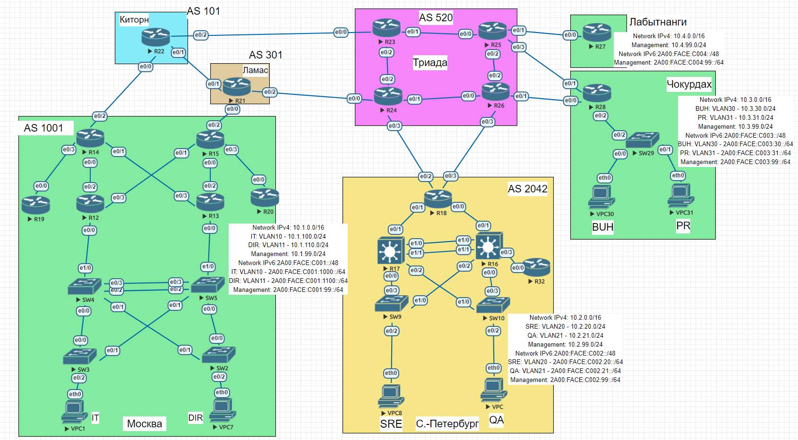

# Архитектура сети 
## Задание:
1. Разработать и задокументировать адресное пространство для лабораторного стенда
2. Настроить ip адреса на каждом активном порту
3. Настроить каждый VPC в каждом офисе в своем VLAN
4. Настроить VLAN управления для сетевых устройств
5. Использовать ipv4 и ipv6
## Решение: 
1. [Задокументируем используемое адресное пространство с использованием IPv4 и IPv6](https://github.com/GAFisher/otus-network-engineer/tree/main/homework_10#задокументируем-используемое-адресное-пространство-с-использованием-ipv4-и-ipv6)
2. Задокументируем выделенные для маршрутизаторов IP-адреса и VLAN'ы
	* Таблица VLAN
	* Таблица адресации Management
	* Офис Лабытнанги
	* Офис Чокурдах
	* Офис Санкт-Петербург
	* Офис Москва
3. Настроим сетевые устройства с учётом приведённой выше схемы и задокументируем изменения
	* Конфигурационные файлы
	* Итоговая графическая схема

## Задокументируем используемое адресное пространство с использованием IPv4 и IPv6
Выделим на каждый офис свою внутреннюю подсеть формата 10.х.0.0/16, где х - порядковый номер офиса.
Для Триады для внутренних маршрутизаторов выделим подсеть 35.10.65.0/24, для подключения внешних маршрутизаторов выделим подсеть 95.165.х.0/30, где х – идентификатор маршрутизатора.

### Общая таблица сетей
|              Devices            |       Network IPv4      |          Network IPv6         |
|:-------------------------------:|:-----------------------:|:-----------------------------:|
|              Москва             |        10.1.0.0/16      |       2A00:FACE:C001::/48     |
|          Санкт-Петербург        |        10.2.0.0/16      |       2A00:FACE:C002::/48     |
|             Чокурдах            |        10.3.0.0/16      |       2A00:FACE:C003::/48     |
|            Лабытнанги           |        10.4.0.0/16      |       2A00:FACE:C004::/48     |
|              Триада             |       35.10.65.0/24     |      2A00::BEDA:D005::/48     |
|          Триада - Киртон        |      95.165.110.0/30    |      2001:20DA:EDA:1::/64     |
|          Триада - Ламас         |      95.165.120.0/30    |      2001:20DA:EDA:2::/64     |
|     Триада - Санкт-Петербург    |      95.165.120.4/30    |      2001:20DA:EDA:3::/64     |
|                                 |      95.165.140.4/30    |      2001:20DA:EDA:7::/64     |
|         Триада – Чокурдах       |      95.165.130.4/30    |      2001:20DA:EDA:5::/64     |
|                                 |      95.165.140.0/30    |      2001:20DA:EDA:6::/64     |
|        Триада - Лабытнанги      |      95.165.130.0/30    |      2001:20DA:EDA:4::/64     |
|          Ламас - Москва         |      78.25.80.88/30     |     1A00:4700:D0:C005::/64    |
|          Киртон – Ламас         |      128.0.128.0/30     |     64:FF9B:5276:1EB4::/64    |
|          Киртон - Москва        |     84.52.118.224/30    |     2606:4700:D0:C009::/64    |

## Задокументируем выделенные для сетевых устройств IP-адреса и VLAN'ы
Выделим для каждого VPC в каждом офисе свой VLAN. Для управления сетевыми устройствами выделим VLAN 99. Нативным будет VLAN 1000. 
#### Таблица VLAN
|           VLAN         |        Name       |     Interface   Assigned    |
|:----------------------:|:-----------------:|:---------------------------:|
|         Чокурдах       |                   |                             |
|            30          |         BUH       |          SW29: e0/1         |
|            31          |         PR        |          SW29: e0/2         |
|     Санкт-Петербург    |                   |                             |
|            20          |         SRE       |           SW9: e0/2         |
|            21          |         QA        |          SW10: e0/2         |
|          Москва        |                   |                             |
|            10          |         IT        |           SW3: e0/2         |
|            11          |         DIR       |           SW2: e0/2         |
|          Общие         |                   |                             |
|            99          |     Management    |              N/A            |
|           1000         |       Native      |              N/A            |

Для управления сетевыми устройствами выделим подсеть 10.х.99.0/24. Адреса сетевых устройств в последнем октете будут иметь цифру, совпадающую с номером устройства на схеме. Link-local адреса IPv6 будут в последнем октете иметь цифру, совпадающую с номером устройства на схеме.
#### Таблица адресации Management 
|          Device        |     IPv4   Address    |     Network   IPv4    |          IPv6   Address         |         Network   IPv6        |     IPv6   LL    |
|:----------------------:|:---------------------:|:---------------------:|:-------------------------------:|:-----------------------------:|:----------------:|
|                                                                     Лабытнанги                                                                              |
|           R27          |        10.4.99.1      |      10.4.99.0/24     |      2A00:FACE:C004:99::1/64    |     2A00:FACE:C004:99::/64    |      FE80::27    |
|     Чокурдах           |                       |                       |                                 |                               |                  |
|           R28          |        10.3.99.1      |      10.3.99.0/24     |      2A00:FACE:C003:99::1/64    |     2A00:FACE:C003:99::/64    |      FE80::29    |
|           SW29         |       10.3.99.29      |      10.3.99.0/24     |     2A00:FACE:C003:99::29/64    |     2A00:FACE:C003:99::/64    |      FE80::29    |
|     Санкт-Петербург    |                       |                       |                                 |                               |                  |
|           R18          |       10.2.99.18      |      10.2.99.0/24     |     2A00:FACE:C002:99::18/64    |     2A00:FACE:C002:99::/64    |      FE80::18    |
|           R17          |       10.2.99.17      |      10.2.99.0/24     |     2A00:FACE:C002:99::17/64    |     2A00:FACE:C002:99::/64    |      FE80::17    |
|           R16          |       10.2.99.16      |      10.2.99.0/24     |     2A00:FACE:C002:99::16/64    |     2A00:FACE:C002:99::/64    |      FE80::16    |
|           R32          |       10.2.99.32      |      10.2.99.0/24     |     2A00:FACE:C002:99::32/64    |     2A00:FACE:C002:99::/64    |      FE80::32    |
|           SW9          |        10.2.99.9      |      10.2.99.0/24     |      2A00:FACE:C002:99::9/64    |     2A00:FACE:C002:99::/64    |      FE80::9     |
|           SW10         |       10.2.99.10      |      10.2.99.0/24     |     2A00:FACE:C002:99::10/64    |     2A00:FACE:C002:99::/64    |      FE80::10    |
|     Москва             |                       |                       |                                 |                               |                  |
|           R14          |       10.1.99.14      |      10.1.99.0/24     |     2A00:FACE:C001:99::14/64    |     2A00:FACE:C002:99::/64    |      FE80::14    |
|           R15          |       10.1.99.15      |      10.1.99.0/24     |     2A00:FACE:C001:99::15/64    |     2A00:FACE:C002:99::/64    |      FE80::15    |
|           R13          |       10.1.99.13      |      10.1.99.0/24     |     2A00:FACE:C001:99::13/64    |     2A00:FACE:C002:99::/64    |      FE80::13    |
|           R12          |       10.1.99.12      |      10.1.99.0/24     |     2A00:FACE:C001:99::12/64    |     2A00:FACE:C002:99::/64    |      FE80::12    |
|           R20          |       10.1.99.20      |      10.1.99.0/24     |     2A00:FACE:C001:99::20/64    |     2A00:FACE:C002:99::/64    |      FE80::20    |
|           R19          |       10.1.99.19      |      10.1.99.0/24     |     2A00:FACE:C001:99::19/64    |     2A00:FACE:C002:99::/64    |      FE80::19    |
|           SW4          |        10.1.99.4      |      10.1.99.0/24     |      2A00:FACE:C001:99::4/64    |     2A00:FACE:C002:99::/64    |      FE80::4     |
|           SW5          |        10.1.99.5      |      10.1.99.0/24     |      2A00:FACE:C001:99::5/64    |     2A00:FACE:C002:99::/64    |      FE80::5     |
|           SW3          |        10.1.99.3      |      10.1.99.0/24     |      2A00:FACE:C001:99::3/64    |     2A00:FACE:C002:99::/64    |      FE80::3     |
|           SW2          |        10.1.99.2      |      10.1.99.0/24     |      2A00:FACE:C001:99::2/64    |     2A00:FACE:C002:99::/64    |      FE80::2     |
|     Киртон             |                       |                       |                                 |                               |                  |
|           R22          |       10.5.99.22      |      10.5.99.0/24     |     2A00:FACE:C005:99::22/64    |     2A00:FACE:C005:99::/64    |      FE80::22    |
|     Ламас              |                       |                       |                                 |                               |                  |
|           R21          |       10.6.99.21      |      10.6.99.0/24     |     2A00:FACE:C006:99::21/64    |     2A00:FACE:C006:99::/64    |      FE80::21    |
|     Триада             |                       |                       |                                 |                               |                  |
|           R23          |       10.7.99.23      |      10.7.99.0/24     |     2A00:FACE:C007:99::23/64    |     2A00:FACE:C007:99::/64    |      FE80::23    |
|           R24          |       10.7.99.24      |      10.7.99.0/24     |     2A00:FACE:C007:99::24/64    |     2A00:FACE:C007:99::/64    |      FE80::24    |
|           R25          |       10.7.99.25      |      10.7.99.0/24     |     2A00:FACE:C007:99::25/64    |     2A00:FACE:C007:99::/64    |      FE80::25    |
|           R26          |       10.7.99.26      |      10.7.99.0/24     |     2A00:FACE:C007:99::26/64    |     2A00:FACE:C007:99::/64    |      FE80::26    |

### Офис Лабытнанги
#### Таблица адресации
|     Device    |     Interface    |     IPv4   Address    |      Network   IPv4    |         IPv6   Address       |        Network   IPv6       |     IPv6   LL    |     Description    |
|:-------------:|:----------------:|:---------------------:|:----------------------:|:----------------------------:|:---------------------------:|:----------------:|:------------------:|
|       R27     |        e0/0      |      95.165.130.2     |     95.165.130.0/30    |     2001:20DA:EDA:4::2/64    |     2001:20DA:EDA:4::/64    |      FE80::27    |      Triad-R25     |

### Офис Чокурдах
#### Таблица адресации
|     Device    |     Interface    |     IPv4 Address    |      Network   IPv4    |           IPv6 Address         |         Network   IPv6        |     IPv6   LL    |     Description    |
|:-------------:|:----------------:|:-------------------:|:----------------------:|:------------------------------:|:-----------------------------:|:----------------:|:------------------:|
|       R28     |        e0/0      |     95.165.140.2    |     95.165.140.0/30    |      2001:20DA:EDA:6::2/64     |      2001:20DA:EDA:6::/64     |      FE80::28    |      Triad-R26     |
|               |        e0/1      |     95.165.130.6    |     95.165.130.4/30    |      2001:20DA:EDA:5::6/64     |      2001:20DA:EDA:5::/64     |      FE80::28    |      Triad-R25     |
|               |      e0/2.30     |       10.3.30.1     |       10.3.30.0/24     |     2A00:FACE:C003:30::1/64    |     2A00:FACE:C003:30::/64    |      FE80::28    |      BUH-VPC30     |
|               |      e0/2.31     |       10.3.31.1     |       10.3.31.0/24     |     2A00:FACE:C003:31::1/64    |     2A00:FACE:C003:31::/64    |      FE80::28    |       PR-VPC31     |
|      VPC30    |        NIC       |         DHCP        |       10.3.30.0/24     |              SLAAC             |     2A00:FACE:C003:30::/64    |       SLAAC      |         BUH        |
|      VPC31    |        NIC       |         DHCP        |       10.3.31.0/24     |              SLAAC             |     2A00:FACE:C003:31::/64    |       SLAAC      |          PR        |

### Офис Санкт-Петербург
#### Таблица адресации
|     Device    |     Interface    |     IPv4 Address    |      Network   IPv4    |            IPv6 Address          |          Network   IPv6        |     IPv6   LL    |        Description       |
|:-------------:|:----------------:|:-------------------:|:----------------------:|:--------------------------------:|:------------------------------:|:----------------:|:------------------------:|
|       R18     |        e0/2      |     95.165.120.6    |     95.165.120.4/30    |       2001:20DA:EDA:3::6/64      |       2001:20DA:EDA:3::/64     |      FE80::18    |         Triad-R24        |
|               |        e0/3      |     95.165.140.6    |     95.165.140.4/30    |       2001:20DA:EDA:7::6/64      |       2001:20DA:EDA:7::/64     |      FE80::18    |         Triad-R26        |
|               |        e0/0      |       10.2.10.6     |       10.2.10.4/30     |      2A00:FACE:C002:40::6/64     |      2A00:FACE:C002:40::/64    |      FE80::18    |     St.Petersburg-R16    |
|               |        e0/1      |      10.2.10.10     |       10.2.10.8/30     |      2A00:FACE:C002:80::10/64    |      2A00:FACE:C002:80::/64    |      FE80::18    |     St.Petersburg-R17    |
|               |        e0/1      |       10.2.10.9     |       10.2.10.8/30     |      2A00:FACE:C002:80::9/64     |      2A00:FACE:C002:80::/64    |      FE80::17    |     St.Petersburg-R18    |
|               |       VLAN20     |       10.2.20.2     |       10.2.20.0/24     |      2A00:FACE:C002:20::2/64     |      2A00:FACE:C002:20::/64    |      FE80::17    |          SRE-VPC8        |
|               |       VLAN21     |       10.2.21.3     |       10.2.21.0/24     |      2A00:FACE:C002:21::3/64     |      2A00:FACE:C002:21::/64    |      FE80::17    |           QA-VPC         |
|               |       VLAN25     |      10.2.10.13     |      10.2.10.12/30     |     2A00:FACE:C002:120::13/64    |     2A00:FACE:C002:120::/64    |      FE80::17    |     St.Petersburg-R16    |
|       R16     |        e0/1      |       10.2.10.5     |       10.2.10.4/30     |      2A00:FACE:C002:40::5/64     |      2A00:FACE:C002:40::/64    |      FE80::16    |     St.Petersburg-R18    |
|               |        e0/3      |       10.2.10.2     |       10.2.10.0/30     |      2A00:FACE:C002:10::2/64     |      2A00:FACE:C002:10::/64    |      FE80::16    |     St.Petersburg-R32    |
|               |       VLAN21     |       10.2.21.2     |       10.2.21.0/24     |      2A00:FACE:C002:21::2/64     |      2A00:FACE:C002:21::/64    |      FE80::16    |           QA-VPC         |
|               |       VLAN20     |       10.2.20.3     |       10.2.20.0/24     |      2A00:FACE:C002:20::3/64     |      2A00:FACE:C002:20::/64    |      FE80::16    |          SRE-VPC8        |
|               |       VLAN25     |      10.2.10.14     |      10.2.10.12/30     |     2A00:FACE:C002:120::14/64    |     2A00:FACE:C002:120::/64    |      FE80::16    |     St.Petersburg-R17    |
|       R32     |        e0/0      |       10.2.10.1     |       10.2.10.0/30     |      2A00:FACE:C002:10::1/64     |      2A00:FACE:C002:10::/64    |      FE80::32    |     St.Petersburg-R16    |
|      VPC8     |        NIC       |         DHCP        |       10.2.20.0/24     |               SLAAC              |      2A00:FACE:C002:20::/64    |       SLAAC      |            SRE           |
|       VPC     |        NIC       |         DHCP        |       10.2.21.0/24     |               SLAAC              |      2A00:FACE:C002:21::/64    |       SLAAC      |             QA           |

### Офис Москва
#### Таблица адресации

|       Device     |     Interface    |      IPv4 Address    |      Network   IPv4     |            IPv6 Address           |          Network   IPv6         |     IPv6   LL    |     Description    |
|:----------------:|:----------------:|:--------------------:|:-----------------------:|:---------------------------------:|:-------------------------------:|:----------------:|:------------------:|
|        R14       |        e0/0      |       10.1.10.9      |       10.1.10.8/30      |      2A00:FACE:C001:800::9/64     |      2A00:FACE:C001:800::/64    |      FE80::14    |      Moscow-R12    |
|                  |        e0/1      |       10.1.10.21     |       10.1.10.20/30     |     2A00:FACE:C001:2000::21/64    |     2A00:FACE:C001:2000::/64    |      FE80::14    |      Moscow-R13    |
|                  |        e0/2      |     84.52.118.226    |     84.52.118.224/30    |      2606:4700:D0:C009::226/64    |      2606:4700:D0:C009::/64     |      FE80::14    |      Kirton-R22    |
|                  |        e0/3      |       10.1.10.2      |       10.1.10.0/30      |      2A00:FACE:C001:100::2/64     |      2A00:FACE:C001:100::/64    |      FE80::14    |      Moscow-R19    |
|        R15       |        e0/0      |       10.1.10.13     |       10.1.10.12/30     |     2A00:FACE:C001:1200::13/64    |     2A00:FACE:C001:1200::/64    |      FE80::15    |      Moscow-R13    |
|                  |        e0/1      |       10.1.10.17     |       10.1.10.16/30     |     2A00:FACE:C001:1600::17/64    |     2A00:FACE:C001:1600::/64    |      FE80::15    |      Moscow-R12    |
|                  |        e0/2      |      78.25.80.90     |      78.25.80.88/30     |      1A00:4700:D0:C005::90/64     |      1A00:4700:D0:C005::/64     |      FE80::15    |      Lamas-R21     |
|                  |        e0/3      |       10.1.10.6      |       10.1.10.4/30      |      2A00:FACE:C001:400::6/64     |      2A00:FACE:C001:400::/64    |      FE80::15    |      Moscow-R20    |
|        R19       |        e0/0      |       10.1.10.1      |       10.1.10.0/30      |      2A00:FACE:C001:100::1/64     |      2A00:FACE:C001:100::/64    |      FE80::19    |      Moscow-R14    |
|        R20       |        e0/0      |       10.1.10.5      |       10.1.10.4/30      |      2A00:FACE:C001:400::5/64     |      2A00:FACE:C001:400::/64    |      FE80::20    |      Moscow-R15    |
|     R12          |      e0/0.10     |       10.1.100.2     |       10.1.100.0/24     |      2A00:FACE:C001:1000::2/64    |     2A00:FACE:C001:1000::/64    |      FE80::12    |       IT-VPC1      |
|                  |      e0/0.11     |       10.1.110.3     |       10.1.110.0/24     |      2A00:FACE:C001:1100::3/64    |     2A00:FACE:C001:1100::/64    |      FE80::12    |       DIR-VPC7     |
|                  |        e0/2      |       10.1.10.10     |       10.1.10.8/30      |      2A00:FACE:C001:800::10/64    |      2A00:FACE:C001:800::/64    |      FE80::12    |      Moscow-R14    |
|                  |        e0/3      |       10.1.10.18     |       10.1.10.16/30     |     2A00:FACE:C001:1600::18/64    |     2A00:FACE:C001:1600::/64    |      FE80::12    |      Moscow-R15    |
|        R13       |      e0/0.11     |       10.1.110.2     |       10.1.110.0/24     |      2A00:FACE:C001:1100::2/64    |     2A00:FACE:C001:1100::/64    |      FE80::13    |       DIR-VPC7     |
|                  |      e0/0.10     |       10.1.100.3     |       10.1.100.0/24     |      2A00:FACE:C001:1000::3/64    |     2A00:FACE:C001:1000::/64    |      FE80::13    |       IT-VPC1      |
|                  |        e0/2      |       10.1.10.14     |       10.1.10.12/30     |     2A00:FACE:C001:1200::14/64    |     2A00:FACE:C001:1200::/64    |      FE80::13    |      Moscow-R15    |
|                  |        e0/3      |       10.1.10.22     |       10.1.10.20/30     |     2A00:FACE:C001:2000::22/64    |     2A00:FACE:C001:2000::/64    |      FE80::13    |      Moscow-R14    |
|        VPC1      |        NIC       |          DHCP        |       10.1.100.0/24     |                SLAAC              |     2A00:FACE:C001:1000::/64    |       SLAAC      |          IT        |
|        VPC7      |        NIC       |          DHCP        |       10.1.110.0/24     |                SLAAC              |     2A00:FACE:C001:1100::/64    |       SLAAC      |         DIR        |
### ISP
#### Таблица адресации
|     Device    |     Interface    |      IPv4 Address    |      Network   IPv4     |            IPv6 Address          |         Network   IPv6        |     IPv6   LL    |        Description       |
|:-------------:|:----------------:|:--------------------:|:-----------------------:|:--------------------------------:|:-----------------------------:|:----------------:|:------------------------:|
|               |       Киртон     |                      |                         |                                  |                               |                  |                          |
|       R22     |        e0/0      |     84.52.118.225    |     84.52.118.224/30    |     2606:4700:D0:C009::225/64    |     2606:4700:D0:C009::/64    |      FE80::22    |         Moscow-R14       |
|               |        e0/1      |      128.0.128.1     |      128.0.128.0/30     |      64:FF9B:5276:1EB4::1/64     |     64:FF9B:5276:1EB4::/64    |      FE80::22    |         Lamas-R21        |
|               |        e0/2      |      95.165.110.2    |      95.165.110.0/30    |       2001:20DA:EDA:1::2/64      |      2001:20DA:EDA:1::/64     |      FE80::22    |         Triad-R23        |
|               |       Ламас      |                      |                         |                                  |                               |                  |                          |
|       R22     |        e0/0      |      78.25.80.89     |      78.25.80.88/30     |      1A00:4700:D0:C005::89/64    |     1A00:4700:D0:C005::/64    |      FE80::15    |         Moscow-R15       |
|               |        e0/1      |      128.0.128.2     |      128.0.128.0/30     |      64:FF9B:5276:1EB4::2/64     |     64:FF9B:5276:1EB4::/64    |      FE80::15    |         Kirton-R22       |
|               |        e0/2      |      95.165.120.2    |      95.165.120.0/30    |       2001:20DA:EDA:2::2/64      |      2001:20DA:EDA:2::/64     |      FE80::15    |         Triad-R24        |
|               |       Триада     |                      |                         |                                  |                               |                  |                          |
|       R23     |        e0/0      |      95.165.110.1    |      95.165.110.0/30    |       2001:20DA:EDA:1::1/64      |      2001:20DA:EDA:1::/64     |      FE80::23    |         Kirton-R22       |
|               |        e0/1      |       35.10.65.1     |       35.10.65.0/28     |       2A00:BEDA:D005:1::1/64     |      2A00:BEDA:D005:1::/64    |      FE80::23    |         Triad-R25        |
|               |        e0/2      |      35.10.65.33     |      35.10.65.32/28     |      2A00:BEDA:D005:2::33/64     |      2A00:BEDA:D005:2::/64    |      FE80::23    |         Triad-R24        |
|       R24     |        e0/0      |      95.165.120.1    |      95.165.120.0/30    |       2001:20DA:EDA:2::1/64      |      2001:20DA:EDA:2::/64     |      FE80::24    |         Lamas-R21        |
|               |        e0/1      |      35.10.65.17     |      35.10.65.16/28     |      2A00:BEDA:D005:3::17/64     |      2A00:BEDA:D005:3::/64    |      FE80::24    |         Triad-R26        |
|               |        e0/2      |      35.10.65.34     |      35.10.65.32/28     |      2A00:BEDA:D005:2::34/64     |      2A00:BEDA:D005:2::/64    |      FE80::24    |         Triad-R23        |
|               |        e0/3      |      95.165.120.5    |      95.165.120.4/30    |       2001:20DA:EDA:3::5/64      |      2001:20DA:EDA:3::/64     |      FE80::24    |     St.Petersburg-R18    |
|       R25     |        e0/0      |       35.10.65.2     |       35.10.65.0/28     |       2A00:BEDA:D005:1::2/64     |     2A00::BEDA:D005:1::/64    |      FE80::25    |         Triad-R23        |
|               |        e0/1      |      95.165.130.1    |      95.165.130.0/30    |       2001:20DA:EDA:4::1/64      |      2001:20DA:EDA:4::/64     |      FE80::25    |       Labytnangi-R27     |
|               |        e0/2      |      35.10.65.49     |      35.10.65.48/28     |      2A00:BEDA:D005:4::49/64     |     2A00::BEDA:D005:4::/64    |      FE80::25    |         Triad-R26        |
|               |        e0/3      |      95.165.130.5    |      95.165.130.4/30    |       2001:20DA:EDA:5::5/64      |      2001:20DA:EDA:5::/64     |      FE80::25    |       Chokurdah-R28      |
|       R26     |        e0/0      |      35.10.65.18     |      35.10.65.16/28     |      2A00:BEDA:D005:3::18/64     |      2A00:BEDA:D005:3::/64    |      FE80::26    |         Triad-R24        |
|               |        e0/1      |      95.165.140.1    |      95.165.140.0/30    |       2001:20DA:EDA:6::1/64      |      2001:20DA:EDA:6::/64     |      FE80::26    |       Chokurdah-R28      |
|               |        e0/2      |      35.10.65.50     |      35.10.65.48/28     |      2A00:BEDA:D005:4::50/64     |      2A00:BEDA:D005:4::/64    |      FE80::26    |         Triad-R25        |
|               |        e0/3      |      95.165.140.5    |      95.165.140.4/30    |       2001:20DA:EDA:7::5/64      |      2001:20DA:EDA:7::/64     |      FE80::26    |     St.Petersburg-R18    |

## Настроим IP-адреса с учетом приведённой выше схемы и задокументируем изменения
Все файлы конфигураций приведены здесь.
#### Топология

