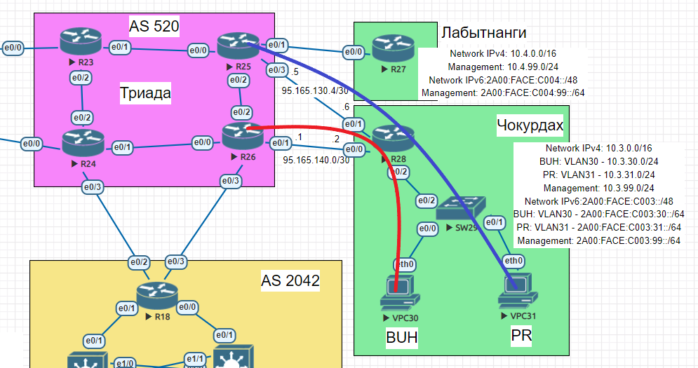

# Маршрутизация на основе политик (PBR) 
## Задание:
1. Настроить политику маршрутизации для сетей офиса Чокурдах
2. Распределить трафик между двумя линками с провайдером
3. Настроить отслеживание линка через технологию IP SLA
4. Настроить для офиса Лабытнанги маршрут по-умолчанию
5. План работы и изменения зафиксируем в документации
## Решение: 
1. [Настроим отслеживание линков в сторону ISP](https://github.com/GAFisher/otus-network-engineer/blob/main/homework_11/README.md#1-настроим-отслеживание-линков-в-сторону-isp)
2. [Настроим политику маршрутизации для распределения трафика между двумя линками с провайдером](https://github.com/GAFisher/otus-network-engineer/blob/main/homework_11/README.md#2-настроим-политику-маршрутизации-для-распределения-трафика-между-двумя-линками-с-провайдером)
3. [Настроим для офиса Лабытнанги маршрут по-умолчанию](https://github.com/GAFisher/otus-network-engineer/blob/main/homework_11/README.md#3-настроим-для-офиса-лабытнанги-маршрут-по-умолчанию)
### 1. Настроим отслеживание линков в сторону ISP:
Настроим IP SLA тесты для проверки доступности линков провайдера (icmp-echo):
```
Chokurdah-R28#configure terminal 
Chokurdah-R28(config)#ip sla 1
Chokurdah-R28(config-ip-sla)# icmp-echo 95.165.140.1 source-ip 95.165.140.2
Chokurdah-R28(config-ip-sla-echo)# frequency 5
Chokurdah-R28(config-ip-sla-echo)#ip sla schedule 1 life forever start-time now        
Chokurdah-R28(config)#ip sla 2
Chokurdah-R28(config-ip-sla)# icmp-echo 95.165.130.5 source-ip 95.165.130.6
Chokurdah-R28(config-ip-sla-echo)# frequency 5
Chokurdah-R28(config-ip-sla-echo)#ip sla schedule 2 life forever start-time now        
Chokurdah-R28(config)#exit
```
Проверим состояние тестов и убедимся, что они работают:
```
Chokurdah-R28#sh ip sla summary 
IPSLAs Latest Operation Summary
Codes: * active, ^ inactive, ~ pending

ID           Type        Destination       Stats       Return      Last
                                           (ms)        Code        Run 
-----------------------------------------------------------------------
*1           icmp-echo   95.165.140.1      RTT=1       OK          4 seconds ago
                                                                                
                                                                                
                                                                                
                                                                                
*2           icmp-echo   95.165.130.5      RTT=1       OK          4 seconds ago
                                                                                
                                                                                
                                                                                
                                                                                

Chokurdah-R28#
```
Настроим track для отслеживания теста IP SLA:
```
Chokurdah-R28#configure terminal
Chokurdah-R28(config)#track 10 ip sla 1 reachability
Chokurdah-R28(config-track)#delay down 10 up 5                     
Chokurdah-R28(config-track)#exit
Chokurdah-R28(config)#track 20  ip sla 2 reachability
Chokurdah-R28(config-track)#delay down 10 up 5                     
Chokurdah-R28(config-track)#end
```
Проверим работу track:
```
Chokurdah-R28#show track 
Track 10
  IP SLA 1 reachability
  Reachability is Up
    4 changes, last change 00:08:40
  Delay up 5 secs, down 10 secs
  Latest operation return code: OK
  Latest RTT (millisecs) 1
Track 20
  IP SLA 2 reachability
  Reachability is Up
    8 changes, last change 00:08:05
  Delay up 5 secs, down 10 secs
  Latest operation return code: OK
  Latest RTT (millisecs) 1
Chokurdah-R28#
```
Добавим статические маршруты на провайдера и привяжем track:
```
Chokurdah-R28#configure terminal
Chokurdah-R28(config)#ip route 0.0.0.0 0.0.0.0 95.165.140.1 50 track 10   
Chokurdah-R28(config)#ip route 0.0.0.0 0.0.0.0 95.165.130.5 100 track 20
```
[[Наверх]](https://github.com/GAFisher/otus-network-engineer/blob/main/homework_11/README.md#маршрутизация-на-основе-политик-pbr)

### 2. Настроим политику маршрутизации для распределения трафика между двумя линками с провайдером
Настроим правила для отбора трафика из каждого VLAN’а:
```
Chokurdah-R28#configure terminal 
Chokurdah-R28(config)#ip access-list extended BUH-VPC30
Chokurdah-R28(config-ext-nacl)#permit ip 10.3.30.0 0.0.0.255 any
Chokurdah-R28(config-ext-nacl)#exit
Chokurdah-R28(config)#ip access-list extended PR-VPC31
Chokurdah-R28(config-ext-nacl)#permit ip 10.3.31.0 0.0.0.255 any
Chokurdah-R28(config-ext-nacl)#exit
```
Настроим политику маршрутизации так, чтобы трафик VLAN30 отправлялся через ISP1(Triad-R26), а трафик VLAN31 отправлялся через ISP2(Triad-R25). К каждой route-map привяжем track, чтобы маршрут выбирался динамически на основании мониторинга IP SLA.
```
Chokurdah-R28(config)#route-map ISP2 permit 10
Chokurdah-R28(config-route-map)#description Triad-R25 
Chokurdah-R28(config-route-map)#match ip address PR-VPC31
Chokurdah-R28(config-route-map)#set ip next-hop verify-availability 95.165.130.5 10 track 20
Chokurdah-R28(config-route-map)#set ip next-hop verify-availability 95.165.140.1 20 track 10
Chokurdah-R28(config-route-map)#exit
Chokurdah-R28(config)#interface Ethernet0/2.31
Chokurdah-R28(config-subif)#ip policy route-map ISP2
Chokurdah-R28(config-subif)#exit
Chokurdah-R28(config)#route-map ISP1 permit 10
Chokurdah-R28(config-route-map)#description Triad-R26 
Chokurdah-R28(config-route-map)#match ip address BUH-VPC30
Chokurdah-R28(config-route-map)#set ip next-hop verify-availability 95.165.140.1 10 track 10 
Chokurdah-R28(config-route-map)#set ip next-hop verify-availability 95.165.130.5 20 track 20
Chokurdah-R28(config-route-map)#exit
Chokurdah-R28(config)#interface Ethernet0/2.30
Chokurdah-R28(config-subif)#ip policy route-map ISP1
Chokurdah-R28(config-subif)#exit
```
#### Графическая схема PBR:

[[Наверх]](https://github.com/GAFisher/otus-network-engineer/blob/main/homework_11/README.md#маршрутизация-на-основе-политик-pbr)

### 3. Настроим для офиса Лабытнанги маршрут по-умолчанию
```
Labytnangi-R27#configure terminal 
Labytnangi-R27(config)#ip route 0.0.0.0 0.0.0.0 Ethernet0/0
Labytnangi-R27(config)#ipv6 route ::/0 Ethernet0/0
Labytnangi-R27(config)#exit
Labytnangi-R27#copy running-config startup-config
Destination filename [startup-config]? 
Building configuration...
[OK]
Labytnangi-R27#
```

```
Labytnangi-R27#show ip route 
Codes: L - local, C - connected, S - static, R - RIP, M - mobile, B - BGP
       D - EIGRP, EX - EIGRP external, O - OSPF, IA - OSPF inter area 
       N1 - OSPF NSSA external type 1, N2 - OSPF NSSA external type 2
       E1 - OSPF external type 1, E2 - OSPF external type 2
       i - IS-IS, su - IS-IS summary, L1 - IS-IS level-1, L2 - IS-IS level-2
       ia - IS-IS inter area, * - candidate default, U - per-user static route
       o - ODR, P - periodic downloaded static route, H - NHRP, l - LISP
       a - application route
       + - replicated route, % - next hop override

Gateway of last resort is 0.0.0.0 to network 0.0.0.0

S*    0.0.0.0/0 is directly connected, Ethernet0/0
      10.0.0.0/8 is variably subnetted, 2 subnets, 2 masks
C        10.4.99.0/24 is directly connected, Loopback1
L        10.4.99.1/32 is directly connected, Loopback1
      95.0.0.0/8 is variably subnetted, 2 subnets, 2 masks
C        95.165.130.0/30 is directly connected, Ethernet0/0
L        95.165.130.2/32 is directly connected, Ethernet0/0
Labytnangi-R27#
Labytnangi-R27#sh ipv6 route
IPv6 Routing Table - default - 6 entries
Codes: C - Connected, L - Local, S - Static, U - Per-user Static route
       B - BGP, HA - Home Agent, MR - Mobile Router, R - RIP
       H - NHRP, I1 - ISIS L1, I2 - ISIS L2, IA - ISIS interarea
       IS - ISIS summary, D - EIGRP, EX - EIGRP external, NM - NEMO
       ND - ND Default, NDp - ND Prefix, DCE - Destination, NDr - Redirect
       O - OSPF Intra, OI - OSPF Inter, OE1 - OSPF ext 1, OE2 - OSPF ext 2
       ON1 - OSPF NSSA ext 1, ON2 - OSPF NSSA ext 2, la - LISP alt
       lr - LISP site-registrations, ld - LISP dyn-eid, a - Application
S   ::/0 [1/0]
     via Ethernet0/0, directly connected
C   2001:20DA:EDA:4::/64 [0/0]
     via Ethernet0/0, directly connected
L   2001:20DA:EDA:4::2/128 [0/0]
     via Ethernet0/0, receive
C   2A00:FACE:C004:99::/64 [0/0]
     via Loopback1, directly connected
L   2A00:FACE:C004:99::1/128 [0/0]
     via Loopback1, receive
L   FF00::/8 [0/0]
     via Null0, receive
Labytnangi-R27#
```
[[Наверх]](https://github.com/GAFisher/otus-network-engineer/blob/main/homework_11/README.md#маршрутизация-на-основе-политик-pbr)
