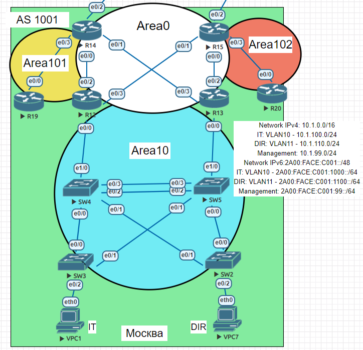

# Многозонный OSPF
## Задание:
1. Настроить OSPF офисе Москва
2. Разделить сеть на зоны
3. Настроить фильтрацию между зонами
## Решение:
1. [Настроим маршрутизаторы R14-R15 в зоне 0](https://github.com/GAFisher/otus-network-engineer/blob/main/homework_15/README.md#настроим-маршрутизаторы-r14-r15-в-зоне-0)
2. [Настроим маршрутизаторы R12-R13 в зоне 10](https://github.com/GAFisher/otus-network-engineer/blob/main/homework_15/README.md#настроим-маршрутизаторы-r12-r13-в-зоне-10)
3. [Настроим маршрутизатор R19 в зоне 101 и получение только маршрут по умолчанию](https://github.com/GAFisher/otus-network-engineer/blob/main/homework_15/README.md#настроим-маршрутизатор-r19-в-зоне-101-и-получение-только-маршрут-по-умолчанию)
4. [Настроим маршрутизатор R20 в зоне 102 и получание всех маршрутов, кроме маршрутов до сетей зоны 101](https://github.com/GAFisher/otus-network-engineer/blob/main/homework_15/README.md#настроим-маршрутизатор-r20-в-зоне-102-и-получание-всех-маршрутов-кроме-маршрутов-до-сетей-зоны-101)
5. [Итоговая графическая схема](https://github.com/GAFisher/otus-network-engineer/blob/main/homework_15/README.md#итоговая-графическая-схема)
### Настроим маршрутизаторы R14-R15 в зоне 0
Маршрутизаторы R14 и R15 являются граничными маршрутизатороми автономной системы (ASBR), т.к. подключены к Интернету, поэтому необходимо настроить распространение маршрута по умолчанию на другие маршрутизаторы с помощью команды ```default-information originate```. 
#### R14
```
Moscow-R14#configure terminal
Moscow-R14(config)#ip route 0.0.0.0 0.0.0.0 84.52.118.225
Moscow-R14(config)#ipv6 route ::/0 2606:4700:D0:C009::225
Moscow-R14(config)#router ospf 1 
Moscow-R14(config-router)# router-id 1.1.1.14
Moscow-R14(config-router)#default-information originate 
Moscow-R14(config-router)#exit
Moscow-R14(config)#ipv6 router ospf 1
Moscow-R14(config-rtr)# router-id 1.1.1.14
Moscow-R14(config-rtr)#default-information originate 
Moscow-R14(config-rtr)#exit
Moscow-R14(config)#interface range Ethernet0/0-1
Moscow-R14(config-if-range)#ip ospf 1 area 0
Moscow-R14(config-if-range)#ipv6 ospf 1 area 0
```
#### R15
```
Moscow-R15#configure terminal
Moscow-R15(config)#ip route 0.0.0.0 0.0.0.0 78.25.80.89
Moscow-R15(config)#ipv6 route ::/0 1A00:4700:D0:C005::89
Moscow-R15(config)#router ospf 1 
Moscow-R14(config-router)# router-id 1.1.1.15
Moscow-R15(config-router)#default-information originate 
Moscow-R15(config-router)#exit
Moscow-R15(config)#ipv6 router ospf 1
Moscow-R14(config-rtr)# router-id 1.1.1.15
Moscow-R15(config-rtr)#default-information originate 
Moscow-R15(config-rtr)#exit
Moscow-R15(config)#interface range Ethernet0/0-1
Moscow-R15(config-if-range)#ip ospf 1 area 0
Moscow-R15(config-if-range)#ipv6 ospf 1 area 0
```
[[Наверх]](https://github.com/GAFisher/otus-network-engineer/blob/main/homework_15/README.md#многозонный-ospf)
### Настроим маршрутизаторы R12-R13 в зоне 10
Дополнительной настройки, кроме включения процесса ospf и включения его на инетерфейсах, т.к. маршрутизаторы являются пограничными (ABR), следовательно они будут передавать всю информацию о маршрутах из граничных областей. 
#### R12
```
Moscow-R12(config)#router ospf 1
Moscow-R12(config-router)#router-id 1.1.1.12
Moscow-R12(config-router)#exit
Moscow-R15(config)#ipv6 router ospf 1
Moscow-R14(config-rtr)# router-id 1.1.1.12
Moscow-R12(config-rtr)#exit
Moscow-R12(config)#interface range Et0/2-3
Moscow-R12(config-if-range)#ip ospf 1 area 0 
Moscow-R12(config-if-range)#ipv6 ospf 1 area 0
Moscow-R12(config)#int Et0/0.10                
Moscow-R12(config-subif)#ip ospf 1 area 10
Moscow-R12(config-subif)#ipv6 ospf 1 area 10
Moscow-R12(config-subif)#exit               
Moscow-R12(config)#int Et0/0.11       
Moscow-R12(config-subif)#ip ospf 1 area 10  
Moscow-R12(config-subif)#ipv6 ospf 1 area 10
```
#### Для R13 настройка аналогична (```router-id 1.1.1.13```)
[[Наверх]](https://github.com/GAFisher/otus-network-engineer/blob/main/homework_15/README.md#многозонный-ospf)
### Настроим маршрутизатор R19 в зоне 101 и получение только маршрут по умолчанию
#### R19
```
Moscow-R19#configure terminal
Moscow-R19(config)#router ospf 1
Moscow-R19(config-router)#router-id 1.1.1.19
Moscow-R19(config-router)#exit
Moscow-R19(config)#ipv6 router ospf 1
Moscow-R19(config-rtr)#router-id 1.1.1.19
Moscow-R19(config-rtr)#exit
Moscow-R19(config)#interface Ethernet0/0
Moscow-R19(config-if)#ip ospf  1 area 101 
Moscow-R19(config-if)#ipv6 ospf 1 area 101
Moscow-R19(config-if)#exit
Moscow-R19(config)#router ospf 1 
Moscow-R19(config-router)#area 101 stub 
Moscow-R19(config-router)#exit
Moscow-R19(config)#ipv6 router ospf 1
Moscow-R19(config-rtr)# area 101 stub
```
Также необходимо произвести настройку со стороны R14
#### R14
```
Moscow-R14(config)#interface Et0/3
Moscow-R14(config-if)#ip ospf 1 area 101 
Moscow-R14(config-if)#ipv6 ospf 1 area 101
Moscow-R14(config-if)#exit
Moscow-R14(config)#router ospf 1
Moscow-R14(config-router)#area 101 stub no-summary
Moscow-R14(config-router)#exit
Moscow-R14(config)#ipv6 router ospf 1
Moscow-R14(config-rtr)# area 101 stub no-summary
```
[[Наверх]](https://github.com/GAFisher/otus-network-engineer/blob/main/homework_15/README.md#многозонный-ospf)
### Настроим маршрутизатор R20 в зоне 102 и получение всех маршрутов, кроме маршрутов до сетей зоны 101
#### R20
```
Moscow-R20#configure terminal
Moscow-R20(config)#router ospf 1 
Moscow-R20(config-router)#router-id 1.1.1.20
Moscow-R20(config-router)#exit
Moscow-R19(config)#ipv6 router ospf 1
Moscow-R19(config-rtr)#router-id 1.1.1.20
Moscow-R19(config-rtr)#exit
Moscow-R20(config)#interface Ethernet0/0
Moscow-R20(config-if)#ip ospf  1 area 102
Moscow-R20(config-if)#ipv6 ospf 1 area 102
```
Также необходимо произвести настройку со стороны R15
#### R15
```
Moscow-R15(config)#interface Et0/3
Moscow-R15(config-if)#ip ospf 1 area 102
Moscow-R15(config-if)#ipv6 ospf 1 area 102
Moscow-R15(config-if)#exit
```
Исключим маршруты до сетей зоны 101
```
Moscow-R15(config)#ip prefix-list AREA101  seq 5 deny  10.1.10.0/30 
Moscow-R15(config)#ip prefix-list AREA101  seq 10 permit 0.0.0.0/0 le 32
Moscow-R15(config)#router ospf 1 
Moscow-R15(config-router)#area 102 filter-list prefix AREA101v6 in
Moscow-R15(config)#ipv6 prefix-list AREA101v6 seq 5 deny 2A00:FACE:C001:100::/64
Moscow-R15(config)#ipv6 prefix-list AREA101v6 seq 10 permit ::/0 le 128 
Moscow-R15(config)#ipv6 router ospf 1
Moscow-R15(config-rtr)#area 102 filter-list prefix AREA101v6 in
```
### Итоговая графическая схема
 

[[Наверх]](https://github.com/GAFisher/otus-network-engineer/blob/main/homework_15/README.md#многозонный-ospf)

Все файлы изменений приведены [здесь](https://github.com/GAFisher/otus-network-engineer/tree/main/homework_15/configs).
