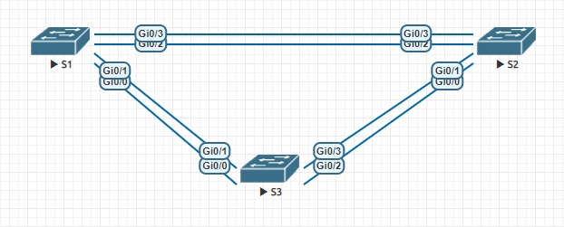
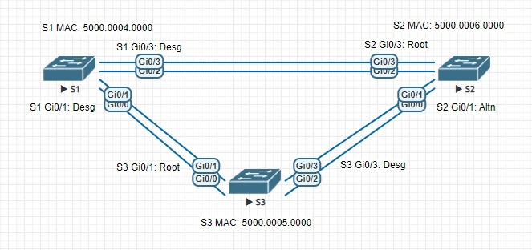

# Развертывание коммутируемой сети с резервными каналами
## Задание: 

## Топология

## Таблица адресации
|  				Устройство 			 |  				Интерфейс 			 |    				IP-адрес 			  |  				Маска подсети 			 |
|:------------:|:-----------:|:-------------:|:---------------:|
|  				S1 			         |  				VLAN 1 			    |  				192.168.1.1 			 |  				255.255.255.0 			 |
|  				S2 			         |  				VLAN 1 			    |  				192.168.1.2 			 |  				255.255.255.0 			 |
|  				S3 			         |  				VLAN 1 			    |  				192.168.1.3 			 |  				255.255.255.0 			 |
## Решение:
1. Создание сети и настройка основных параметров устройств
    * Настроим базовые параметры каждого коммутатора
    
    
    
    
    
    
    
    
    
## 1. Создание сети и настройка основных параметров устройств
### Настроим базовые параметры каждого коммутатора:
```
Switch>enable
Switch#configure terminal
Switch(config)#no ip domain-lookup
Switch(config)#hostname S1
S1(config)#enable secret class
S1(config)#line console 0
S1(config-line)#password cisco
S1(config-line)#login
S1(config-line)#logging synchronous
S1(config-line)#exit
S1(config)#line vty 0 4
S1(config-line)#password cisco
S1(config-line)#login
S1(config-line)#exit
S1(config)#banner motd #Authorized Access Only!#
S1(config)#interface vlan 1
S1(config-if)#ip address 192.168.1.1 255.255.255.0
S1(config-if)#no shutdown
S1(config-if)#end
S1#copy running-config startup-config
Destination filename [startup-config]? 
Building configuration...
Compressed configuration from 3204 bytes to 1578 bytes[OK]
S1#
```
```
Switch>enable
Switch#configure terminal
Switch(config)#no ip domain-lookup
Switch(config)#hostname S2
S2(config)#enable secret class
S2(config)#line console 0
S2(config-line)#password cisco
S2(config-line)#login
S2(config-line)#logging synchronous
S2(config-line)#exit
S2(config)#line vty 0 4
S2(config-line)#password cisco
S2(config-line)#login
S2(config-line)#exit
S2(config)#banner motd #Authorized Access Only!#
S2(config)#interface vlan 1
S2(config-if)#ip address 192.168.1.2 255.255.255.0
S2(config-if)#no shutdown
S2(config-if)#end
S2#copy running-config startup-config
Destination filename [startup-config]? 
Building configuration...
Compressed configuration from 3204 bytes to 1580 bytes[OK]
S2#
```
```
Switch>enable
Switch#configure terminal
Switch(config)#no ip domain-lookup
Switch(config)#hostname S3
S3(config)#enable secret class
S3(config)#line console 0
S3(config-line)#password cisco
S3(config-line)#login
S3(config-line)#logging synchronous
S3(config-line)#exit
S3(config)#line vty 0 4
S3(config-line)#password cisco
S3(config-line)#login
S3(config-line)#exit
S3(config)#banner motd #Authorized Access Only!#
S3(config)#interface vlan 1
S3(config-if)#ip address 192.168.1.3 255.255.255.0
S3(config-if)#no shutdown
S3(config-if)#end
S3#copy running-config startup-config
Destination filename [startup-config]? 
Building configuration...
Compressed configuration from 3204 bytes to 1571 bytes[OK]
S3#
```
### Проверим связь:
Эхо-запрос от коммутатора S1 на коммутатор S2 выполняется успешно:
```
S1#ping 192.168.1.2
Type escape sequence to abort.
Sending 5, 100-byte ICMP Echos to 192.168.1.2, timeout is 2 seconds:
!!!!!
Success rate is 100 percent (5/5), round-trip min/avg/max = 2/2/3 ms
S1#
```
Эхо-запрос от коммутатора S1 на коммутатор S3 выполняется успешно:
```
S1#ping 192.168.1.3
Type escape sequence to abort.
Sending 5, 100-byte ICMP Echos to 192.168.1.3, timeout is 2 seconds:
!!!!!
Success rate is 100 percent (5/5), round-trip min/avg/max = 2/2/3 ms
S1#
```
Эхо-запрос от коммутатора S2 на коммутатор S3 выполняется успешно:
```
S2#ping 192.168.1.3 
Type escape sequence to abort.
Sending 5, 100-byte ICMP Echos to 192.168.1.3, timeout is 2 seconds:
!!!!!
Success rate is 100 percent (5/5), round-trip min/avg/max = 3/3/5 ms
S2#
```
## 2. Определение корневого моста
### Отключим все порты на коммутаторах:
```
S1# configure terminal 
S1(config)#interface range Gi0/0-3
S1(config-if-range)#shutdown
S1(config-if-range)#
```
```
S2#configure terminal 
S2(config)#interface range Gi0/0-3
S2(config-if-range)#shutdown
S2(config-if-range)#
```
```
S3#configure terminal
S3(config)#interface range Gi0/0-3
S3(config-if-range)#shutdown
S3(config-if-range)#
```
### Настроим подключенные порты в качестве транковых:
```
S1(config-if-range)#switchport mode trunk 
S1(config-if-range)#exit
S1(config)#
```
```
S2(config-if-range)#switchport mode trunk 
S2(config-if-range)#exit
S2(config)#
```
```
S3(config-if-range)#switchport mode trunk 
S3(config-if-range)#exit
S3(config)#
```

### Включим порты Gi0/1 и Gi0/3 на всех коммутаторах:
```
S1(config)#interface range Gi0/1,Gi0/3
S1(config-if-range)#no shutdown
S1(config-if-range)#end
S1#
```
```
S2(config)#interface range Gi0/1,Gi0/3
S2(config-if-range)#no shutdown
S2(config-if-range)#end
S2#
```
```
S3(config)#interface range Gi0/1,Gi0/3
S3(config-if-range)#no shutdown
S3(config-if-range)#end
S3#
```
### Отобразим данные протокола spanning-tree:
```
S1#show spanning-tree

VLAN0001
  Spanning tree enabled protocol rstp
  Root ID    Priority    32769
             Address     5000.0004.0000
             This bridge is the root
             Hello Time   2 sec  Max Age 20 sec  Forward Delay 15 sec

  Bridge ID  Priority    32769  (priority 32768 sys-id-ext 1)
             Address     5000.0004.0000
             Hello Time   2 sec  Max Age 20 sec  Forward Delay 15 sec
             Aging Time  300 sec

Interface           Role Sts Cost      Prio.Nbr Type
------------------- ---- --- --------- -------- --------------------------------
Gi0/1               Desg FWD 4         128.2    Shr 
Gi0/3               Desg FWD 4         128.4    Shr 


S1#
```
```
S2#show spanning-tree

VLAN0001
  Spanning tree enabled protocol rstp
  Root ID    Priority    32769
             Address     5000.0004.0000
             Cost        4
             Port        4 (GigabitEthernet0/3)
             Hello Time   2 sec  Max Age 20 sec  Forward Delay 15 sec

  Bridge ID  Priority    32769  (priority 32768 sys-id-ext 1)
             Address     5000.0006.0000
             Hello Time   2 sec  Max Age 20 sec  Forward Delay 15 sec
             Aging Time  300 sec

Interface           Role Sts Cost      Prio.Nbr Type
------------------- ---- --- --------- -------- --------------------------------
Gi0/1               Altn BLK 4         128.2    Shr 
Gi0/3               Root FWD 4         128.4    Shr 


S2#
```
```	
S3#show spanning-tree

VLAN0001
  Spanning tree enabled protocol rstp
  Root ID    Priority    32769
             Address     5000.0004.0000
             Cost        4
             Port        2 (GigabitEthernet0/1)
             Hello Time   2 sec  Max Age 20 sec  Forward Delay 15 sec

  Bridge ID  Priority    32769  (priority 32768 sys-id-ext 1)
             Address     5000.0005.0000
             Hello Time   2 sec  Max Age 20 sec  Forward Delay 15 sec
             Aging Time  300 sec

Interface           Role Sts Cost      Prio.Nbr Type
------------------- ---- --- --------- -------- --------------------------------
Gi0/1               Root FWD 4         128.2    Shr 
Gi0/3               Desg FWD 4         128.4    Shr 


S3#
```
### В схеме ниже отображены роль и состояние (Sts) активных портов на каждом коммутаторе в топологии.
  

___
Корневым мостом является коммутатор S1.

Этот коммутатор был выбран протоколом spanning-tree в качестве корневого моста, потому что у него наименьший mac-address: 5000.0004.0000 

Корневыми портами являются: на S2 порт Gi0/3, на S3 порт Gi0/1. На S1 нет корневых портов. 
Назначенными портами являются: на S2 порты Gi0/1 и Gi0/3, на S3 порт Gi0/3. На S2 нет назначенных портов.

Порт Gi0/1 на S2 отображается в качестве альтернативного и в настоящее время заблокирован. 
Протокол spanning-tree выбрал этот порт в качестве невыделенного (заблокированного) порта, потому что 

Коммутатор S2 имеет наибольший Bridge ID, поэтому блокировка порта будет происходить на нем. 
Блокируется порт Gi0/1, т.к. он назначенный. 
___


# 3. Наблюдение за процессом выбора протоколом STP порта, исходя из стоимости портов
### Определим коммутатор с заблокированным портом:
```
S2#show spanning-tree

VLAN0001
  Spanning tree enabled protocol rstp
  Root ID    Priority    32769
             Address     5000.0004.0000
             Cost        4
             Port        4 (GigabitEthernet0/3)
             Hello Time   2 sec  Max Age 20 sec  Forward Delay 15 sec

  Bridge ID  Priority    32769  (priority 32768 sys-id-ext 1)
             Address     5000.0006.0000
             Hello Time   2 sec  Max Age 20 sec  Forward Delay 15 sec
             Aging Time  300 sec

Interface           Role Sts Cost      Prio.Nbr Type
------------------- ---- --- --------- -------- --------------------------------
Gi0/1               Altn BLK 4         128.2    Shr 
Gi0/3               Root FWD 4         128.4    Shr 


S2#
```
### Изменим стоимость порта:
```
S2#configure terminal 
S2(config)#interface Gi0/3
S2(config-if)#spanning-tree cost 3
S2(config-if)#end
S2#
```
### Просмотрим изменения протокола spanning-tree:
```
S2#show spanning-tree 

VLAN0001
  Spanning tree enabled protocol rstp
  Root ID    Priority    32769
             Address     5000.0004.0000
             Cost        3
             Port        4 (GigabitEthernet0/3)
             Hello Time   2 sec  Max Age 20 sec  Forward Delay 15 sec

  Bridge ID  Priority    32769  (priority 32768 sys-id-ext 1)
             Address     5000.0006.0000
             Hello Time   2 sec  Max Age 20 sec  Forward Delay 15 sec
             Aging Time  300 sec

Interface           Role Sts Cost      Prio.Nbr Type
------------------- ---- --- --------- -------- --------------------------------
Gi0/1               Desg FWD 4         128.2    Shr 
Gi0/3               Root FWD 3         128.4    Shr 


S2#
```

Ранее заблокированный порт (S2 – Gi0/1) теперь является назначенным портом, и протокол spanning-tree теперь блокирует порт на другом коммутаторе некорневого моста (S3 – Gi0/3):

```
S3#show spanning-tree

VLAN0001
  Spanning tree enabled protocol rstp
  Root ID    Priority    32769
             Address     5000.0004.0000
             Cost        4
             Port        2 (GigabitEthernet0/1)
             Hello Time   2 sec  Max Age 20 sec  Forward Delay 15 sec

  Bridge ID  Priority    32769  (priority 32768 sys-id-ext 1)
             Address     5000.0005.0000
             Hello Time   2 sec  Max Age 20 sec  Forward Delay 15 sec
             Aging Time  300 sec

Interface           Role Sts Cost      Prio.Nbr Type
------------------- ---- --- --------- -------- --------------------------------
Gi0/1               Root FWD 4         128.2    Shr 
Gi0/3               Altn BLK 4         128.4    Shr 


S3#
```
Протокол spanning-tree заменяет ранее заблокированный порт на назначенный порт и блокирует порт, который был назначенным портом на другом коммутаторе, потому что 


### Удалим изменения стоимости порта:
```
S2#configure terminal 
S2(config)#interface Gi0/3	
S2(config-if)#no spanning-tree cost 3 
S2(config-if)#end
S2#show spanning-tree

VLAN0001
  Spanning tree enabled protocol rstp
  Root ID    Priority    32769
             Address     5000.0004.0000
             Cost        4
             Port        4 (GigabitEthernet0/3)
             Hello Time   2 sec  Max Age 20 sec  Forward Delay 15 sec

  Bridge ID  Priority    32769  (priority 32768 sys-id-ext 1)
             Address     5000.0006.0000
             Hello Time   2 sec  Max Age 20 sec  Forward Delay 15 sec
             Aging Time  300 sec

Interface           Role Sts Cost      Prio.Nbr Type
------------------- ---- --- --------- -------- --------------------------------
Gi0/1               Altn BLK 4         128.2    Shr 
Gi0/3               Root FWD 4         128.4    Shr 


S2#
```
# 4. Наблюдение за процессом выбора протоколом STP порта, исходя из приоритета портов

### Включим порты F0/1 и F0/3 на всех коммутаторах:
```	
S1#configure terminal 
S1(config)#interface range Gi0/0, Gi0/2
S1(config-if-range)#no shutdown 

S2#configure terminal 
S2(config)#interface range Gi0/0, Gi0/2
S2(config-if-range)#no shutdown 

S3#configure terminal 
S3(config)#interface range Gi0/0, Gi0/2
S3(config-if-range)#no shutdown 
```
### Выполним команду show spanning-tree на коммутаторах некорневого моста:
```
S2(config-if-range)#end
S2#show spanning-tree

VLAN0001
  Spanning tree enabled protocol rstp
  Root ID    Priority    32769
             Address     5000.0004.0000
             Cost        4
             Port        3 (GigabitEthernet0/2)
             Hello Time   2 sec  Max Age 20 sec  Forward Delay 15 sec

  Bridge ID  Priority    32769  (priority 32768 sys-id-ext 1)
             Address     5000.0006.0000
             Hello Time   2 sec  Max Age 20 sec  Forward Delay 15 sec
             Aging Time  300 sec

Interface           Role Sts Cost      Prio.Nbr Type
------------------- ---- --- --------- -------- --------------------------------
Gi0/0               Altn BLK 4         128.1    Shr 
Gi0/1               Altn BLK 4         128.2    Shr 
Gi0/2               Root FWD 4         128.3    Shr 
Gi0/3               Altn BLK 4         128.4    Shr 


S2#
```
```
S3(config-if-range)#end
S3#show spanning-tree

VLAN0001
  Spanning tree enabled protocol rstp
  Root ID    Priority    32769
             Address     5000.0004.0000
             Cost        4
             Port        1 (GigabitEthernet0/0)
             Hello Time   2 sec  Max Age 20 sec  Forward Delay 15 sec

  Bridge ID  Priority    32769  (priority 32768 sys-id-ext 1)
             Address     5000.0005.0000
             Hello Time   2 sec  Max Age 20 sec  Forward Delay 15 sec
             Aging Time  300 sec

Interface           Role Sts Cost      Prio.Nbr Type
------------------- ---- --- --------- -------- --------------------------------
Gi0/0               Root FWD 4         128.1    Shr 
Gi0/1               Altn BLK 4         128.2    Shr 
Gi0/2               Desg FWD 4         128.3    Shr 
Gi0/3               Desg FWD 4         128.4    Shr 


S3#
```
Протоколом STP в качестве порта корневого моста выбрал: на S2 порт Gi0/2, на S3 порты Gi0/2 и Gi0/3.
протокол STP выбрал эти порты, потому что 


