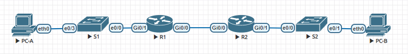

# Реализация DHCPv4
## Задание: 
1. Создать сеть и настроить основные параметры устройств
2. Настроить и проверить работу двух серверов DHCPv4 на R1
3. Настроить и проверить работу DHCP-ретрансляции на R2
## Топология
## Таблица адресации

## Решение:


## 1. Создание сети и настройка основных параметров устройств
### Создать схему адресации
Подсеть сети 192.168.1.0/24 разобьем в соответствии со следующими требованиями:
##### «Подсеть A» поддерживает 58 хостов: 
```
192.168.1.0/26 
Диапазон: 192.168.1.0 - 192.168.1.63
```
##### «Подсеть B» поддерживает 28 хостов:
```
192.168.1.64/27  
Диапазон: 192.168.1.65 - 192.168.1.94
```
##### «Подсеть C» поддерживает 12 хостов:
```
192.168.1.96/28	
Диапазон: 192.168.1.97 - 192.168.1.110
```
### Произведем базовую настройку маршрутизаторов
##### Маршрутизатор R1:
```
Router>enable
Router#configure terminal
Router(config)#hostname R1
R1(config)#no ip domain lookup
R1(config)#enable secret class
R1(config)#line console 0
R1(config-line)#password cisco
R1(config-line)#login
R1(config-line)#exit
R1(config)#line vty 0 4
R1(config-line)#password cisco
R1(config-line)#login
R1(config-line)#exit
R1(config)#service password-encryption 
R1(config)#banner motd #Authorized Access Only!#
R1(config)#end
R1#                          
R1#copy running-config startup-config
R1#clock set 11:57:00 27 Mar 2021
R1#
```
##### Маршрутизатор R2:
```
Router>enable 
Router#configure terminal 
Router(config)#hostname R2
R2(config)#no ip domain lookup
R2(config)#enable secret class
R2(config)#line console 0
R2(config-line)#password cisco
R2(config-line)#login 
R2(config-line)#exit
R2(config)#line vty 0 4
R2(config-line)#password cisco
R2(config-line)#login
R2(config-line)#exit
R2(config)#service password-encryption 
R2(config)#banner motd #Authorized Access Only!#
R2(config)#end
R2#copy running-config startup-config
R2#clock set 11:59:00 27 Mar 2021
R2#
```


