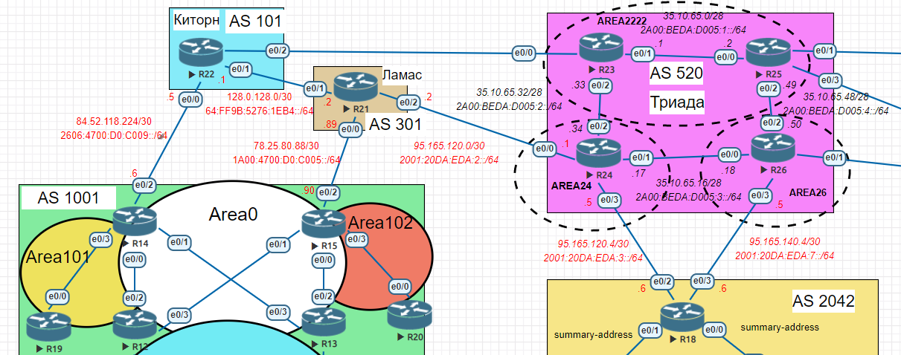

# Настройка BGP между автономными системами
## Задание:
1. Настроить BGP между автономными системами
2. Организовать доступность между офисами Москва и С.-Петербург
### Топология:

## Решение:
1. [Настроим eBGP между офисом Москва и двумя провайдерами - Киторн и Ламас;](https://github.com/GAFisher/otus-network-engineer/blob/main/homework_bgp/README.md#1-настроим-ebgp-между-офисом-москва-и-двумя-провайдерами---киторн-и-ламас)
2. [Настроим eBGP между провайдерами Киторн и Ламас;](https://github.com/GAFisher/otus-network-engineer/blob/main/homework_bgp/README.md#2-настроим-ebgp-между-провайдерами-киторн-и-ламас)
3. [Настроим eBGP между провайдерамиЛамас и Триада;](https://github.com/GAFisher/otus-network-engineer/blob/main/homework_bgp/README.md#3-настроим-ebgp-между-провайдерами-ламас-и-триада)
4. [Настроим eBGP между офисом С.-Петербург и провайдером Триада;](https://github.com/GAFisher/otus-network-engineer/blob/main/homework_bgp/README.md#4-настроим-ebgp-между-офисом-с-петербург-и-провайдером-триада)
5. [Проверим и убедимся, что BGP поднялся между настроенными маршрутизаторами;](https://github.com/GAFisher/otus-network-engineer/blob/main/homework_bgp/README.md#5-проверим-и-убедимся-что-bgp-поднялся-между-настроенными-маршрутизаторами)
6. [Организуем IP доступность между пограничным роутерами офисами Москва и С.-Петербург;](https://github.com/GAFisher/otus-network-engineer/blob/main/homework_bgp/README.md#6-организуем-ip-доступность-между-пограничным-роутерами-офисами-москва-и-с-петербург)
7. [Проверим и убедимся, что IP доступность между офисами присутствует;](https://github.com/GAFisher/otus-network-engineer/blob/main/homework_bgp/README.md#7-проверим-и-убедимся-что-ip-доступность-между-офисами-присутствует)
8. Итоговые таблицы маршрутизаци eBGP для IPv4 и IPv6 на маршрутизаторах.

### 1. Настроим eBGP между офисом Москва и двумя провайдерами - Киторн и Ламас
Запустим BGP процесс на R22 и поднимем пиринг с R14:
#### R22 (Киртон)
```
Kirton-R22#configure terminal
Kirton-R22(config)#router bgp 101
Kirton-R22(config-router)#bgp router-id 22.22.22.22
Kirton-R22(config-router)#neighbor 84.52.118.226 remote-as 1001
Kirton-R22(config-router)#neighbor 2606:4700:D0:C009::226 remote-as 1001
Kirton-R22(config-router)#address-family ipv6 
Kirton-R22(config-router-af)#neighbor 2606:4700:D0:C009::226 activate
Kirton-R22(config-router)#end
Kirton-R22#wr
```
Конфигурация с обратной стороны симметрична:
#### R14 (Москва)
```
Moscow-R14#configure terminal 
Moscow-R14(config)#router bgp 1001
Moscow-R14(config-router)#bgp router-id 14.14.14.14
Moscow-R14(config-router)#neighbor 84.52.118.225 remote-as 101
Moscow-R14(config-router)#neighbor 2606:4700:D0:C009::225 remote-as 101
Moscow-R14(config-router)#address-family ipv6
Moscow-R14(config-router-af)#neighbor 2606:4700:D0:C009::225 activate
Moscow-R14(config-router)#end
Moscow-R14#wr
```
Запустим BGP процесс на R21 и поднимем пиринг с R15:
#### R21 (Ламас)
```
Lamas-R21#configure terminal 
Lamas-R21(config)#router bgp 301
Lamas-R21(config-router)#bgp router-id 21.21.21.21
Lamas-R21(config-router)#neighbor 78.25.80.90 remote-as 1001 
Lamas-R21(config-router)#neighbor 1A00:4700:D0:C005::90 remote-as 1001
Lamas-R21(config-router)#address-family ipv6
Lamas-R21(config-router-af)#neighbor 1A00:4700:D0:C005::90 activate
Lamas-R21(config-router)#end
Lamas-R21#wr
```
Конфигурация с обратной стороны симметрична:
#### R15 (Москва)
```
Moscow-R15#configure terminal
Moscow-R15(config)#router bgp 1001
Moscow-R15(config-router)#bgp router-id 15.15.15.15 
Moscow-R15(config-router)#neighbor 78.25.80.89 remote-as 301
Moscow-R15(config-router)#neighbor 1A00:4700:D0:C005::89 remote-as 301
Moscow-R15(config-router)#address-family ipv6
Moscow-R15(config-router-af)#neighbor 1A00:4700:D0:C005::89 activate
Moscow-R15(config-router)#end
Moscow-R15#wr
```

[[Наверх]](https://github.com/GAFisher/otus-network-engineer/blob/main/homework_bgp/README.md#настройка-bgp-между-автономными-системами)
### 2. Настроим eBGP между провайдерами Киторн и Ламас
#### R22 (Киртон)
```
Kirton-R22#configure terminal
Kirton-R22(config)#router bgp 101
Kirton-R22(config-router)#neighbor 128.0.128.2 remote-as 301
Kirton-R22(config-router)#neighbor 64:FF9B:5276:1EB4::2 remote-as 301
Kirton-R22(config-router)#address-family ipv6 
Kirton-R22(config-router-af)#neighbor 64:FF9B:5276:1EB4::2 activate
Kirton-R22(config-router)#end
Kirton-R22#wr
```
#### R21 (Ламас)
```
Lamas-R21#configure terminal 
Lamas-R21(config)#router bgp 301
Lamas-R21(config-router)#neighbor 128.0.128.1 remote-as 101
Lamas-R21(config-router)#neighbor 64:FF9B:5276:1EB4::1 remote-as 101
Lamas-R21(config-router)#address-family ipv6
Lamas-R21(config-router-af)#neighbor 64:FF9B:5276:1EB4::1 activate 
Lamas-R21(config-router)#end
Lamas-R21#wr
```

[[Наверх]](https://github.com/GAFisher/otus-network-engineer/blob/main/homework_bgp/README.md#настройка-bgp-между-автономными-системами)
### 3. Настроим eBGP между провайдерами Ламас и Триада
#### R21 (Ламас)
```
Lamas-R21#configure terminal
Lamas-R21(config)#router bgp 301
Lamas-R21(config-router)#neighbor 95.165.120.1 remote-as 520
Lamas-R21(config-router)#neighbor 2001:20DA:EDA:2::1 remote-as 520
Lamas-R21(config-router)#address-family ipv6
Lamas-R21(config-router-af)#neighbor 2001:20DA:EDA:2::1 activate
Lamas-R21(config-router)#end
```
#### R24 (Триада)
```
Triad-R24#configure terminal
Triad-R24(config)#router bgp 520
Triad-R24(config-router)#bgp router-id 24.24.24.24
Triad-R24(config-router)#neighbor 95.165.120.2 remote-as 301
Triad-R24(config-router)#neighbor 2001:20DA:EDA:2::2 remote-as 301
Triad-R24(config-router)#address-family ipv6 
Triad-R24(config-router-af)#neighbor 2001:20DA:EDA:2::2 activate
Triad-R24(config-router)#end
Triad-R24#wr
```
[[Наверх]](https://github.com/GAFisher/otus-network-engineer/blob/main/homework_bgp/README.md#настройка-bgp-между-автономными-системами)
### 4. Настроим eBGP между офисом С.-Петербург и провайдером Триада
#### R24 (Триада)
```
Triad-R24#configure terminal
Triad-R24(config)#router bgp 520
Triad-R24(config-router)#neighbor  95.165.120.6 remote-as 2042
Triad-R24(config-router)#neighbor 2001:20DA:EDA:3::6 remote-as 2042
Triad-R24(config-router)#address-family ipv6
Triad-R24(config-router-af)#neighbor 2001:20DA:EDA:3::6 activate
Triad-R24(config-router)#end
Triad-R24#wr
```
#### R26 (Триада)
```
Triad-R26#configure terminal 
Triad-R26(config)#router bgp 520
Triad-R26(config-router)#bgp router-id 26.26.26.26
Triad-R26(config-router)#neighbor  95.165.140.6 remote-as 2042
Triad-R26(config-router)#neighbor 2001:20DA:EDA:7::6 remote-as 2042
Triad-R26(config-router)#address-family ipv6 
Triad-R26(config-router-af)#neighbor 2001:20DA:EDA:7::6 activate
Triad-R26(config-router)#end
Triad-R26#wr
```
#### R18 (С.-Петербург)
```
St.Petersburg-R18#configure terminal 
St.Petersburg-R18(config)#router bgp 2042
St.Petersburg-R18(config-router)#bgp router-id 18.18.18.18
St.Petersburg-R18(config-router)#neighbor  95.165.140.5 remote-as 520
St.Petersburg-R18(config-router)#neighbor  95.165.120.5 remote-as 520
St.Petersburg-R18(config-router)#neighbor 2001:20DA:EDA:3::5 remote-as 520
St.Petersburg-R18(config-router)#neighbor 2001:20DA:EDA:7::5 remote-as 520
St.Petersburg-R18(config-router)#address-family ipv6 
St.Petersburg-R18(config-router-af)#neighbor 2001:20DA:EDA:3::5 activate
St.Petersburg-R18(config-router-af)#neighbor 2001:20DA:EDA:7::5 activate
St.Petersburg-R18(config-router)#end
St.Petersburg-R18#wr
```
### 5. Проверим и убедимся, что BGP поднялся между настроенными маршрутизаторами

<details>
  <summary>R22</summary>
  
    Kirton-R22#show bgp ipv4 unicast summary   
    BGP router identifier 22.22.22.22, local AS number 101
    BGP table version is 1, main routing table version 1

    Neighbor        V           AS MsgRcvd MsgSent   TblVer  InQ OutQ Up/Down  State/PfxRcd
    84.52.118.226   4         1001     284     284        1    0    0 04:16:39        0
    128.0.128.2     4          301     280     279        1    0    0 04:13:34        0
    Kirton-R22#
    Kirton-R22#show bgp ipv6 unicast summary   
    BGP router identifier 22.22.22.22, local AS number 101
    BGP table version is 1, main routing table version 1

    Neighbor        V           AS MsgRcvd MsgSent   TblVer  InQ OutQ Up/Down  State/PfxRcd
    64:FF9B:5276:1EB4::2
                    4          301      36      36        1    0    0 00:29:32        0
    2606:4700:D0:C009::226
                    4         1001      30      27        1    0    0 00:23:31        0
    Kirton-R22#

</details>

<details>
  <summary>R21</summary>
  
    Lamas-R21#show bgp ipv4 unicast summary  
    BGP router identifier 21.21.21.21, local AS number 301
    BGP table version is 1, main routing table version 1

    Neighbor        V           AS MsgRcvd MsgSent   TblVer  InQ OutQ Up/Down  State/PfxRcd
    78.25.80.90     4         1001     283     282        1    0    0 04:13:35        0
    95.165.120.1    4          520     280     278        1    0    0 04:10:45        0
    128.0.128.1     4          101     282     283        1    0    0 04:16:18        0
    Lamas-R21#
    Lamas-R21#show bgp ipv6 unicast summary
    BGP router identifier 21.21.21.21, local AS number 301
    BGP table version is 1, main routing table version 1

    Neighbor        V           AS MsgRcvd MsgSent   TblVer  InQ OutQ Up/Down  State/PfxRcd
    64:FF9B:5276:1EB4::1
                    4          101      39      39        1    0    0 00:32:22        0
    1A00:4700:D0:C005::90
                    4         1001      25      23        1    0    0 00:19:47        0
    2001:20DA:EDA:2::1
                    4          520      21      20        1    0    0 00:16:56        0
    Lamas-R21#
  
</details>  
 
<details>
  <summary>R14</summary> 
 
    Moscow-R14#show bgp ipv4 unicast summary  
    BGP router identifier 14.14.14.14, local AS number 1001
    BGP table version is 1, main routing table version 1

    Neighbor        V           AS MsgRcvd MsgSent   TblVer  InQ OutQ Up/Down  State/PfxRcd
    84.52.118.225   4          101     289     289        1    0    0 04:20:50        0
    Moscow-R14#
    Moscow-R14#show bgp ipv6 unicast summary
    BGP router identifier 14.14.14.14, local AS number 1001
    BGP table version is 1, main routing table version 1

    Neighbor        V           AS MsgRcvd MsgSent   TblVer  InQ OutQ Up/Down  State/PfxRcd
    2606:4700:D0:C009::225
                    4          101      32      34        1    0    0 00:27:41        0
    Moscow-R14# 
  
</details>
  
<details>
  <summary>R15</summary>
  
    Moscow-R15#show bgp ipv4 unicast summary  
    BGP router identifier 15.15.15.15, local AS number 1001
    BGP table version is 1, main routing table version 1

    Neighbor        V           AS MsgRcvd MsgSent   TblVer  InQ OutQ Up/Down  State/PfxRcd
    78.25.80.89     4          301     285     285        1    0    0 04:16:06        0
    Moscow-R15#
    Moscow-R15#show bgp ipv6 unicast summary
    BGP router identifier 15.15.15.15, local AS number 1001
    BGP table version is 1, main routing table version 1

    Neighbor        V           AS MsgRcvd MsgSent   TblVer  InQ OutQ Up/Down  State/PfxRcd
    1A00:4700:D0:C005::89
                    4          301      26      28        1    0    0 00:22:11        0
    Moscow-R15#

</details>

<details>
  <summary>R24</summary>
  
    Triad-R24#show bgp ipv4 unicast summary  
    BGP router identifier 24.24.24.24, local AS number 520
    BGP table version is 1, main routing table version 1

    Neighbor        V           AS MsgRcvd MsgSent   TblVer  InQ OutQ Up/Down  State/PfxRcd
    95.165.120.2    4          301     281     284        1    0    0 04:14:15        0
    95.165.120.6    4         2042     279     279        1    0    0 04:12:38        0
    Triad-R24#
    Triad-R24#show bgp ipv6 unicast summary
    BGP router identifier 24.24.24.24, local AS number 520
    BGP table version is 1, main routing table version 1

    Neighbor        V           AS MsgRcvd MsgSent   TblVer  InQ OutQ Up/Down  State/PfxRcd
    2001:20DA:EDA:2::2
                    4          301      24      25        1    0    0 00:20:17        0
    2001:20DA:EDA:3::6
                    4         2042      18      17        1    0    0 00:14:03        0
    Triad-R24#

</details>

<details>
  <summary>R26</summary>
  
    Triad-R26#show bgp ipv4 unicast summary  
    BGP router identifier 26.26.26.26, local AS number 520
    BGP table version is 1, main routing table version 1

    Neighbor        V           AS MsgRcvd MsgSent   TblVer  InQ OutQ Up/Down  State/PfxRcd
    95.165.140.6    4         2042     279     281        1    0    0 04:11:58        0
    Triad-R26#                               
    Triad-R26#show bgp ipv6 unicast summary
    BGP router identifier 26.26.26.26, local AS number 520
    BGP table version is 1, main routing table version 1

    Neighbor        V           AS MsgRcvd MsgSent   TblVer  InQ OutQ Up/Down  State/PfxRcd
    2001:20DA:EDA:7::6
                    4         2042      19      20        1    0    0 00:15:20        0
    Triad-R26#
  
</details>
  
<details>
  <summary>R18</summary> 
  
    St.Petersburg-R18#show bgp ipv4 unicast summary  
    BGP router identifier 18.18.18.18, local AS number 2042
    BGP table version is 1, main routing table version 1

    Neighbor        V           AS MsgRcvd MsgSent   TblVer  InQ OutQ Up/Down  State/PfxRcd
    95.165.120.5    4          520     282     282        1    0    0 04:15:02        0
    95.165.140.5    4          520     282     280        1    0    0 04:13:09        0
    St.Petersburg-R18#                             
    St.Petersburg-R18#show bgp ipv6 unicast summary
    BGP router identifier 18.18.18.18, local AS number 2042
    BGP table version is 1, main routing table version 1

    Neighbor        V           AS MsgRcvd MsgSent   TblVer  InQ OutQ Up/Down  State/PfxRcd
    2001:20DA:EDA:3::5
                    4          520      19      21        1    0    0 00:16:29        0
    2001:20DA:EDA:7::5
                    4          520      22      21        1    0    0 00:16:26        0
    St.Petersburg-R18#

</details>


[[Наверх]](https://github.com/GAFisher/otus-network-engineer/blob/main/homework_bgp/README.md#настройка-bgp-между-автономными-системами)
### 6. Организуем IP доступность между пограничным роутерами офисами Москва и С.-Петербург

Провайдер Киртон должен анонсировать подсети с R14:
```
Kirton-R22#configure terminal
Kirton-R22(config)#router bgp 101
Kirton-R22(config-router)#address-family ipv4
Kirton-R22(config-router-af)#network 84.52.118.224 mask 255.255.255.252
Kirton-R22(config-router-af)#exit
Kirton-R22(config-router)#address-family ipv6
Kirton-R22(config-router-af)#network 2606:4700:D0:C009::/64 
Kirton-R22(config-router-af)#end
Kirton-R22#wr
```
Провайдер Ламас должен анонсировать подсети с R15:
```
Lamas-R21# configure terminal
Lamas-R21(config)#router bgp 301
Lamas-R21(config-router)#address-family ipv4
Lamas-R21(config-router-af)#network 78.25.80.88 mask 255.255.255.252
Lamas-R21(config-router-af)#exit
Lamas-R21(config-router)#address-family ipv6
Lamas-R21(config-router-af)#network 1A00:4700:D0:C005::/64
Lamas-R21(config-router-af)#end                           
Lamas-R21#wr
```
Провайдер Триада должен анонсировать подсети с С.-Петербурга:
#### R24
```
Triad-R24#configure terminal 
Triad-R24(config)#router bgp 520
Triad-R24(config-router)#address-family ipv4          
Triad-R24(config-router-af)#network 95.165.120.4 mask 255.255.255.252
Triad-R24(config-router-af)#exit
Triad-R24(config-router)#address-family ipv6
Triad-R24(config-router-af)#network 2001:20DA:EDA:3::/64
Triad-R24(config-router-af)#end                         
Triad-R24#wr
```
#### R26
```
Triad-R26#configure terminal 
Triad-R26(config)#router bgp 520
Triad-R26(config-router)#address-family ipv4
Triad-R26(config-router-af)#network 95.165.140.4 mask 255.255.255.252
Triad-R26(config-router-af)#exit
Triad-R26(config-router)#address-family ipv6
Triad-R26(config-router-af)#network 2001:20DA:EDA:7::/64
Triad-R26(config-router-af)#end                         
Triad-R26#wr
```
С.-Петербург анонсирует свои стыковочные подсети в провайдера Триада: 
```
St.Petersburg-R18#configure terminal
St.Petersburg-R18(config)#router bgp 2042
St.Petersburg-R18(config-router)# address-family ipv4
St.Petersburg-R18(config-router-af)#network  95.165.140.4 mask 255.255.255.252
St.Petersburg-R18(config-router-af)#network 95.165.120.4 mask 255.255.255.252
St.Petersburg-R18(config-router-af)#exit
St.Petersburg-R18(config-router)#address-family ipv6
St.Petersburg-R18(config-router-af)#network 2001:20DA:EDA:3::/64
St.Petersburg-R18(config-router-af)#network 2001:20DA:EDA:7::/64
St.Petersburg-R18(config-router-af)#end                         
St.Petersburg-R18#wr
``` 
### 7. Проверим и убедимся, что IP доступность между офисами присутствует
Москва -> С.-Петербург

<details>
  <summary>R14</summary>
  
        Moscow-R14#ping 95.165.120.6
        Type escape sequence to abort.
        Sending 5, 100-byte ICMP Echos to 95.165.120.6, timeout is 2 seconds:
        !!!!!
        Success rate is 100 percent (5/5), round-trip min/avg/max = 1/1/2 ms
        Moscow-R14#traceroute 95.165.120.6
        Type escape sequence to abort.
        Tracing the route to 95.165.120.6
        VRF info: (vrf in name/id, vrf out name/id)
          1 84.52.118.225 [AS 101] 0 msec 0 msec 1 msec
          2 128.0.128.2 0 msec 1 msec 0 msec
          3 95.165.120.1 1 msec 0 msec 1 msec
          4 95.165.120.6 [AS 520] 0 msec *  1 msec
        Moscow-R14#ping 2001:20DA:EDA:3::6
        Type escape sequence to abort.
        Sending 5, 100-byte ICMP Echos to 2001:20DA:EDA:3::6, timeout is 2 seconds:
        !!!!!
        Success rate is 100 percent (5/5), round-trip min/avg/max = 1/4/17 ms
        Moscow-R14#traceroute 2001:20DA:EDA:3::6
        Type escape sequence to abort.
        Tracing the route to 2001:20DA:EDA:3::6

          1 2606:4700:D0:C009::225 [AS 101] 1 msec 0 msec 1 msec
          2 64:FF9B:5276:1EB4::2 0 msec 0 msec 0 msec
          3 2001:20DA:EDA:2::1 1 msec 1 msec 0 msec
          4 2001:20DA:EDA:3::6 [AS 520] 0 msec 0 msec 1 msec
        Moscow-R14#
        Moscow-R14#ping 95.165.140.6
        Type escape sequence to abort.
        Sending 5, 100-byte ICMP Echos to 95.165.140.6, timeout is 2 seconds:
    !!!!!
    Success rate is 100 percent (5/5), round-trip min/avg/max = 1/1/2 ms
    Moscow-R14#traceroute 95.165.140.6
    Type escape sequence to abort.
    Tracing the route to 95.165.140.6
    VRF info: (vrf in name/id, vrf out name/id)
      1 84.52.118.225 [AS 101] 1 msec 5 msec 0 msec
      2 128.0.128.2 1 msec 0 msec 0 msec
      3 95.165.120.1 0 msec 1 msec 0 msec
      4 95.165.120.6 [AS 520] 0 msec *  1 msec
    Moscow-R14#ping 2001:20DA:EDA:7::6
    Type escape sequence to abort.
    Sending 5, 100-byte ICMP Echos to 2001:20DA:EDA:7::6, timeout is 2 seconds:
    !!!!!
    Success rate is 100 percent (5/5), round-trip min/avg/max = 1/1/1 ms
    Moscow-R14#traceroute 2001:20DA:EDA:7::6
    Type escape sequence to abort.
    Tracing the route to 2001:20DA:EDA:7::6

      1 2606:4700:D0:C009::225 [AS 101] 1 msec 4 msec 1 msec
      2 64:FF9B:5276:1EB4::2 0 msec 1 msec 0 msec
      3 2001:20DA:EDA:2::1 1 msec 1 msec 0 msec
      4 2001:20DA:EDA:3::6 [AS 520] 2 msec 1 msec 0 msec
    Moscow-R14#

</details>


<details>
  <summary>R15</summary>

      Moscow-R15#traceroute 95.165.120.6
      Type escape sequence to abort.
      Tracing the route to 95.165.120.6
      VRF info: (vrf in name/id, vrf out name/id)
        1 78.25.80.89 [AS 301] 0 msec 0 msec 0 msec
        2 95.165.120.1 1 msec 0 msec 0 msec
        3 95.165.120.6 [AS 520] 1 msec *  1 msec
      Moscow-R15#ping 2001:20DA:EDA:3::6
      Type escape sequence to abort.
      Sending 5, 100-byte ICMP Echos to 2001:20DA:EDA:3::6, timeout is 2 seconds:
      !!!!!
      Success rate is 100 percent (5/5), round-trip min/avg/max = 1/1/1 ms
      Moscow-R15#traceroute 2001:20DA:EDA:3::6
      Type escape sequence to abort.
      Tracing the route to 2001:20DA:EDA:3::6

        1 1A00:4700:D0:C005::89 [AS 301] 0 msec 1 msec 0 msec
        2 2001:20DA:EDA:2::1 1 msec 0 msec 0 msec
        3 2001:20DA:EDA:3::6 [AS 520] 0 msec 1 msec 0 msec
      Moscow-R15#
      Moscow-R15#ping 95.165.140.6
      Type escape sequence to abort.
      Sending 5, 100-byte ICMP Echos to 95.165.140.6, timeout is 2 seconds:
      !!!!!
      Success rate is 100 percent (5/5), round-trip min/avg/max = 1/1/1 ms
      Moscow-R15#traceroute 95.165.140.6
      Type escape sequence to abort.
      Tracing the route to 95.165.140.6
      VRF info: (vrf in name/id, vrf out name/id)
        1 78.25.80.89 [AS 301] 0 msec 0 msec 1 msec
        2 95.165.120.1 0 msec 1 msec 0 msec
        3 95.165.120.6 [AS 520] 1 msec *  1 msec
      Moscow-R15#ping 2001:20DA:EDA:7::6
      Type escape sequence to abort.
      Sending 5, 100-byte ICMP Echos to 2001:20DA:EDA:7::6, timeout is 2 seconds:
      !!!!!
      Success rate is 100 percent (5/5), round-trip min/avg/max = 1/1/1 ms
      Moscow-R15#traceroute 2001:20DA:EDA:7::6
      Type escape sequence to abort.
      Tracing the route to 2001:20DA:EDA:7::6

        1 1A00:4700:D0:C005::89 [AS 301] 1 msec 0 msec 0 msec
        2 2001:20DA:EDA:2::1 0 msec 1 msec 0 msec
        3 2001:20DA:EDA:3::6 [AS 520] 1 msec 0 msec 1 msec
      Moscow-R15#

</details>

С.-Петербург -> Москва 

<details>
  <summary>R18</summary>
  
      St.Petersburg-R18#ping 84.52.118.226
      Type escape sequence to abort.
      Sending 5, 100-byte ICMP Echos to 84.52.118.226, timeout is 2 seconds:
      !!!!!
      Success rate is 100 percent (5/5), round-trip min/avg/max = 1/1/1 ms
      St.Petersburg-R18#traceroute 84.52.118.226
      Type escape sequence to abort.
      Tracing the route to 84.52.118.226
      VRF info: (vrf in name/id, vrf out name/id)
        1 95.165.120.5 5 msec 1 msec 0 msec
        2 95.165.120.2 1 msec 0 msec 2 msec
        3 128.0.128.1 0 msec 0 msec 0 msec
        4 84.52.118.226 [AS 101] 1 msec *  1 msec
      St.Petersburg-R18#ping 2606:4700:D0:C009::226
      Type escape sequence to abort.
      Sending 5, 100-byte ICMP Echos to 2606:4700:D0:C009::226, timeout is 2 seconds:
      !!!!!
      Success rate is 100 percent (5/5), round-trip min/avg/max = 1/1/1 ms
      St.Petersburg-R18#traceroute 2606:4700:D0:C009::226
      Type escape sequence to abort.
      Tracing the route to 2606:4700:D0:C009::226

        1 2001:20DA:EDA:3::5 0 msec 0 msec 0 msec
        2 2001:20DA:EDA:2::2 0 msec 1 msec 0 msec
        3 64:FF9B:5276:1EB4::1 1 msec 0 msec 1 msec
        4 2606:4700:D0:C009::226 [AS 101] 1 msec 1 msec 0 msec
      St.Petersburg-R18#
      St.Petersburg-R18#ping 78.25.80.90
      Type escape sequence to abort.
      Sending 5, 100-byte ICMP Echos to 78.25.80.90, timeout is 2 seconds:
      !!!!!
      Success rate is 100 percent (5/5), round-trip min/avg/max = 1/1/1 ms
      St.Petersburg-R18#traceroute 78.25.80.90
      Type escape sequence to abort.
      Tracing the route to 78.25.80.90
      VRF info: (vrf in name/id, vrf out name/id)
        1 95.165.120.5 1 msec 0 msec 1 msec
        2 95.165.120.2 0 msec 1 msec 0 msec
        3 78.25.80.90 [AS 301] 2 msec *  1 msec
      St.Petersburg-R18#ping 1A00:4700:D0:C005::90
      Type escape sequence to abort.
      Sending 5, 100-byte ICMP Echos to 1A00:4700:D0:C005::90, timeout is 2 seconds:
      !!!!!
      Success rate is 100 percent (5/5), round-trip min/avg/max = 1/1/2 ms
      St.Petersburg-R18#traceroute 1A00:4700:D0:C005::90
      Type escape sequence to abort.
      Tracing the route to 1A00:4700:D0:C005::90

        1 2001:20DA:EDA:3::5 1 msec 0 msec 0 msec
        2 2001:20DA:EDA:2::2 1 msec 0 msec 1 msec
        3 1A00:4700:D0:C005::90 [AS 301] 0 msec 1 msec 1 msec
      St.Petersburg-R18#
  
</details>

[[Наверх]](https://github.com/GAFisher/otus-network-engineer/blob/main/homework_bgp/README.md#настройка-bgp-между-автономными-системами)

#### 8. Итоговые таблицы маршрутизаци eBGP для IPv4 и IPv6 на маршрутизаторах

<details>
  <summary>R14</summary>

        Moscow-R14#show bgp ipv4 unicast | begin Network
           Network          Next Hop            Metric LocPrf Weight Path
       *>  78.25.80.88/30   84.52.118.225                          0 101 301 i
       r>  84.52.118.224/30 84.52.118.225            0             0 101 i
       *>  95.165.120.4/30  84.52.118.225                          0 101 301 520 i
       *>  95.165.140.4/30  84.52.118.225                          0 101 301 520 2042 i
      Moscow-R14#
      Moscow-R14#show bgp ipv6 unicast | begin Network
           Network          Next Hop            Metric LocPrf Weight Path
       *>  1A00:4700:D0:C005::/64
                             2606:4700:D0:C009::225
                                                                    0 101 301 i
       *>  2001:20DA:EDA:3::/64
                             2606:4700:D0:C009::225
                                                                    0 101 301 520 i
       *>  2001:20DA:EDA:7::/64
                             2606:4700:D0:C009::225
                                                                    0 101 301 520 2042 i
       r>  2606:4700:D0:C009::/64
                             2606:4700:D0:C009::225
                                                      0             0 101 i
      Moscow-R14#
  
</details>

<details>
  <summary>R15</summary>
  
        Moscow-R15#show bgp ipv4 unicast | begin Network
           Network          Next Hop            Metric LocPrf Weight Path
       r>  78.25.80.88/30   78.25.80.89              0             0 301 i
       *>  84.52.118.224/30 78.25.80.89                            0 301 101 i
       *>  95.165.120.4/30  78.25.80.89                            0 301 520 i
       *>  95.165.140.4/30  78.25.80.89                            0 301 520 2042 i
      Moscow-R15#
      Moscow-R15#show bgp ipv6 unicast | begin Network
           Network          Next Hop            Metric LocPrf Weight Path
       r>  1A00:4700:D0:C005::/64
                             1A00:4700:D0:C005::89
                                                      0             0 301 i
       *>  2001:20DA:EDA:3::/64
                             1A00:4700:D0:C005::89
                                                                    0 301 520 i
       *>  2001:20DA:EDA:7::/64
                             1A00:4700:D0:C005::89
                                                                    0 301 520 2042 i
       *>  2606:4700:D0:C009::/64
                             1A00:4700:D0:C005::89
                                                                    0 301 101 i
      Moscow-R15#

</details>

<details>
  <summary>R22</summary>

        Kirton-R22#show bgp ipv4 unicast | begin Network
           Network          Next Hop            Metric LocPrf Weight Path
       *>  78.25.80.88/30   128.0.128.2              0             0 301 i
       *>  84.52.118.224/30 0.0.0.0                  0         32768 i
       *>  95.165.120.4/30  128.0.128.2                            0 301 520 i
       *>  95.165.140.4/30  128.0.128.2                            0 301 520 2042 i
      Kirton-R22#
      Kirton-R22#show bgp ipv6 unicast | begin Network
           Network          Next Hop            Metric LocPrf Weight Path
       *>  1A00:4700:D0:C005::/64
                             64:FF9B:5276:1EB4::2
                                                      0             0 301 i
       *>  2001:20DA:EDA:3::/64
                             64:FF9B:5276:1EB4::2
                                                                    0 301 520 i
       *>  2001:20DA:EDA:7::/64
                             64:FF9B:5276:1EB4::2
                                                                    0 301 520 2042 i
       *>  2606:4700:D0:C009::/64
                             ::                       0         32768 i
      Kirton-R22#
  
</details>

<details>
  <summary>R21</summary>
  
        Lamas-R21#show bgp ipv4 unicast | begin Network
           Network          Next Hop            Metric LocPrf Weight Path
       *>  78.25.80.88/30   0.0.0.0                  0         32768 i
       *>  84.52.118.224/30 128.0.128.1              0             0 101 i
       *>  95.165.120.4/30  95.165.120.1             0             0 520 i
       *>  95.165.140.4/30  95.165.120.1                           0 520 2042 i
      Lamas-R21#
      Lamas-R21#show bgp ipv6 unicast | begin Network
           Network          Next Hop            Metric LocPrf Weight Path
       *>  1A00:4700:D0:C005::/64
                             ::                       0         32768 i
       *>  2001:20DA:EDA:3::/64
                             2001:20DA:EDA:2::1
                                                      0             0 520 i
       *>  2001:20DA:EDA:7::/64
                             2001:20DA:EDA:2::1
                                                                    0 520 2042 i
       *>  2606:4700:D0:C009::/64
                             64:FF9B:5276:1EB4::1
                                                      0             0 101 i
Lamas-R21#

</details>

<details>
  <summary>R24</summary>
  
        Triad-R24#show bgp ipv4 unicast | begin Network
           Network          Next Hop            Metric LocPrf Weight Path
       *>  78.25.80.88/30   95.165.120.2             0             0 301 i
       *>  84.52.118.224/30 95.165.120.2                           0 301 101 i
       *   95.165.120.4/30  95.165.120.6             0             0 2042 i
       *>                   0.0.0.0                  0         32768 i
       *>  95.165.140.4/30  95.165.120.6             0             0 2042 i
      Triad-R24#
      Triad-R24#show bgp ipv6 unicast | begin Network
           Network          Next Hop            Metric LocPrf Weight Path
       *>  1A00:4700:D0:C005::/64
                             2001:20DA:EDA:2::2
                                                      0             0 301 i
       *   2001:20DA:EDA:3::/64
                             2001:20DA:EDA:3::6
                                                      0             0 2042 i
       *>                   ::                       0         32768 i
       *>  2001:20DA:EDA:7::/64
                             2001:20DA:EDA:3::6
                                                      0             0 2042 i
       *>  2606:4700:D0:C009::/64
                             2001:20DA:EDA:2::2
                                                                    0 301 101 i
      Triad-R24#

</details>

<details>
  <summary>R26</summary>
  
        Triad-R26#show bgp ipv4 unicast | begin Network
           Network          Next Hop            Metric LocPrf Weight Path
       *>  95.165.120.4/30  95.165.140.6             0             0 2042 i
       *   95.165.140.4/30  95.165.140.6             0             0 2042 i
       *>                   0.0.0.0                  0         32768 i
      Triad-R26#
      Triad-R26#show bgp ipv6 unicast | begin Network
           Network          Next Hop            Metric LocPrf Weight Path
       *>  2001:20DA:EDA:3::/64
                             2001:20DA:EDA:7::6
                                                      0             0 2042 i
       *   2001:20DA:EDA:7::/64
                             2001:20DA:EDA:7::6
                                                      0             0 2042 i
       *>                   ::                       0         32768 i
      Triad-R26#

</details>

<details>
  <summary>R18</summary>

        St.Petersburg-R18#show bgp ipv4 unicast | begin Network
           Network          Next Hop            Metric LocPrf Weight Path
       *>  78.25.80.88/30   95.165.120.5                           0 520 301 i
       *>  84.52.118.224/30 95.165.120.5                           0 520 301 101 i
       *>  95.165.120.4/30  0.0.0.0                  0         32768 i
       *                    95.165.120.5             0             0 520 i
       *>  95.165.140.4/30  0.0.0.0                  0         32768 i
       *                    95.165.140.5             0             0 520 i
      St.Petersburg-R18#
      St.Petersburg-R18#show bgp ipv6 unicast | begin Network
           Network          Next Hop            Metric LocPrf Weight Path
       *>  1A00:4700:D0:C005::/64
                             2001:20DA:EDA:3::5
                                                                    0 520 301 i
       *>  2001:20DA:EDA:3::/64
                             ::                       0         32768 i
       *                    2001:20DA:EDA:3::5
                                                      0             0 520 i
       *>  2001:20DA:EDA:7::/64
                             ::                       0         32768 i
       *                    2001:20DA:EDA:7::5
                                                      0             0 520 i
       *>  2606:4700:D0:C009::/64
                             2001:20DA:EDA:3::5
                                                                    0 520 301 101 i
      St.Petersburg-R18#
  
</details>
[[Наверх]](https://github.com/GAFisher/otus-network-engineer/blob/main/homework_bgp/README.md#настройка-bgp-между-автономными-системами)
