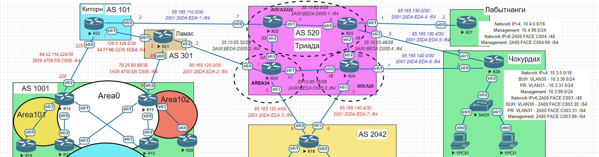

# BGP. Фильтрация
## Задание:
1. Настроить фильтрацию для офиса Москва
2. Настроить фильтрацию для офиса С.-Петербург
### Топология:

## Решение:
1. [Настроить фильтрацию в офисе Москва так, чтобы не появилось транзитного трафика(As-path)](https://github.com/GAFisher/otus-network-engineer/blob/main/homework_bgp_filt/README.md#1-настроим-фильтрацию-в-офисе-москва-так-чтобы-не-появилось-транзитного-трафика);
2. [Настроить фильтрацию в офисе С.-Петербург так, чтобы не появилось транзитного трафика(Prefix-list)](https://github.com/GAFisher/otus-network-engineer/blob/main/homework_bgp_filt/README.md#2-настроим-фильтрацию-в-офисе-с-петербург-так-чтобы-не-появилось-транзитного-трафика);
3. [Настроить провайдера Киторн так, чтобы в офис Москва отдавался только маршрут по умолчанию](https://github.com/GAFisher/otus-network-engineer/blob/main/homework_bgp_filt/README.md#3-настроим-провайдера-киторн-так-чтобы-в-офис-москва-отдавался-только-маршрут-по-умолчанию);
4. [Настроить провайдера Ламас так, чтобы в офис Москва отдавался только маршрут по умолчанию и префикс офиса С.-Петербург](https://github.com/GAFisher/otus-network-engineer/blob/main/homework_bgp_filt/README.md#4-настроим-провайдера-ламас-так-чтобы-в-офис-москва-отдавался-только-маршрут-по-умолчанию-и-префикс-офиса-с-петербург);
5. [Итоговые таблицы BGP](https://github.com/GAFisher/otus-network-engineer/blob/main/homework_bgp_filt/README.md#5-итоговые-таблицы-bgp).


### 1. Настроим фильтрацию в офисе Москва так, чтобы не появилось транзитного трафика 
С помощью As-path ACL разрешим анонсирование локальных маршрутов и запретим анонсы маршрутов из из других AS:
#### R14
```
Moscow-R14#configure terminal
Moscow-R14(config)#ip as-path access-list 1 permit ^$
Moscow-R14(config)#ip as-path access-list 1 deny .*
Moscow-R14(config)#router bgp 1001
Moscow-R14(config-router)#address-family ipv4
Moscow-R14(config-router-af)#neighbor 84.52.118.225 filter-list 1 out
Moscow-R14(config-router-af)#exit
Moscow-R14(config-router)#address-family ipv6
Moscow-R14(config-router-af)#neighbor 2606:4700:D0:C009::225 filter-list 1 out
Moscow-R14(config-router-af)#end
Moscow-R14#wr
```
#### R15
```
Moscow-R15#configure terminal
Moscow-R15(config)#ip as-path access-list 1 permit ^$
Moscow-R15(config)#ip as-path access-list 1 deny .*
Moscow-R15(config)#router bgp 1001
Moscow-R15(config-router)#address-family ipv4
Moscow-R15(config-router-af)#neighbor 78.25.80.89 filter-list 1 out 
Moscow-R15(config-router-af)#exit
Moscow-R15(config-router)#address-family ipv6
Moscow-R15(config-router-af)#neighbor 1A00:4700:D0:C005::89 filter-list 1 out          
Moscow-R15(config-router-af)#end
Moscow-R15#wr
```
[[Наверх]](https://github.com/GAFisher/otus-network-engineer/blob/main/homework_bgp_filt/README.md#bgp-фильтрация)
### 2. Настроим фильтрацию в офисе С.-Петербург так, чтобы не появилось транзитного трафика
С помощью prefix-list'ов запретим принимать анонсы любых подсетей и привяжем к Route Map:
```
St.Petersburg-R18#configure terminal
St.Petersburg-R18(config)#ip prefix-list LIST_OUT1 seq 15 deny 0.0.0.0/0 le 32 
St.Petersburg-R18(config)#ipv6 prefix-list LIST_OUT2 seq 15 deny deny ::/0 le 128
St.Petersburg-R18(config)#route-map UPLINK-OUT1 permit 10
St.Petersburg-R18(config-route-map)#match ip address prefix-list LIST_OUT1
St.Petersburg-R18(config-route-map)#exit
St.Petersburg-R18(config)#route-map UPLINK-OUT2 permit 10
St.Petersburg-R18(config-route-map)# match ipv6 address prefix-list LIST_OUT2
St.Petersburg-R18(config-route-map)#exit
St.Petersburg-R18(config)#router bgp 2042
St.Petersburg-R18(config-router)#address-family ipv4
St.Petersburg-R18(config-router-af)#neighbor 95.165.120.5 route-map UPLINK-OUT1 out
St.Petersburg-R18(config-router-af)#neighbor 95.165.140.5 route-map UPLINK-OUT1 out
St.Petersburg-R18(config-router-af)#exit
St.Petersburg-R18(config-router)#address-family ipv6
St.Petersburg-R18(config-router-af)#neighbor 2001:20DA:EDA:3::5 route-map UPLINK-OUT2 out
St.Petersburg-R18(config-router-af)#neighbor 2001:20DA:EDA:7::5 route-map UPLINK-OUT2 out
St.Petersburg-R18(config-router-af)#end
St.Petersburg-R18#wr
```

### 3. Настроим провайдера Киторн так, чтобы в офис Москва отдавался только маршрут по умолчанию
Настроим передачу Default Route нижестоящему маршрутизатору (R14) и с помощью prefix-list укажем, чтобы R22 передавал только маршрут по умолчанию и ничего лишнего:
```
Kirton-R22#configure terminal
Kirton-R22(config)#ip prefix-list DEFAULTv4 seq 5 permit 0.0.0.0/0           
Kirton-R22(config)#ip prefix-list DEFAULTv4 seq 10 deny 0.0.0.0/0 le 32
Kirton-R22(config)#ipv6 prefix-list DEFAULTv6 seq 5 permit ::/0
Kirton-R22(config)#ipv6 prefix-list DEFAULTv6 seq 10 deny ::/0 le 128
Kirton-R22(config)#route-map DEFAULTv4 permit 10 
Kirton-R22(config-route-map)#match ip address prefix-list DEFAULTv4
Kirton-R22(config-route-map)#exit
Kirton-R22(config)#route-map DEFAULTv6 permit 10     
Kirton-R22(config-route-map)#match ipv6 address prefix-list DEFAULTv6
Kirton-R22(config-route-map)#exit
Kirton-R22(config)#router bgp 101
Kirton-R22(config-router)#address-family ipv4 
Kirton-R22(config-router-af)#neighbor 84.52.118.226 default-originate 
Kirton-R22(config-router-af)#neighbor 84.52.118.226 route-map DEFAULTv4 out 
Kirton-R22(config-router)#address-family ipv6
Kirton-R22(config-router-af)#neighbor 2606:4700:D0:C009::226 default-originate
Kirton-R22(config-router-af)#neighbor 2606:4700:D0:C009::226 route-map DEFAULTv6 out
Kirton-R22(config-router-af)#end
Kirton-R22#wr
```
[[Наверх]](https://github.com/GAFisher/otus-network-engineer/blob/main/homework_bgp_filt/README.md#bgp-фильтрация)
### 4. Настроим провайдера Ламас так, чтобы в офис Москва отдавался только маршрут по умолчанию и префикс офиса С.-Петербург
```
Lamas-R21#configure terminal
Lamas-R21(config)#ip prefix-list DEFAULTv4 seq 5 permit 0.0.0.0/0
Lamas-R21(config)#ip prefix-list DEFAULTv4 seq 10 permit 95.165.120.4/30
Lamas-R21(config)#ip prefix-list DEFAULTv4 seq 15 permit 95.165.140.4/30
Lamas-R21(config)#ipv6 prefix-list DEFAULTv6 seq 5 permit ::/0
Lamas-R21(config)#ipv6 prefix-list DEFAULTv6 seq 10 permit 2001:20DA:EDA:3::/64
Lamas-R21(config)#ipv6 prefix-list DEFAULTv6 seq 15 permit 2001:20DA:EDA:7::/64
Lamas-R21(config)#route-map DEFAULTv4 permit 10
Lamas-R21(config-route-map)#match ip address prefix-list DEFAULTv4 
Lamas-R21(config-route-map)#exit
Lamas-R21(config)#route-map DEFAULTv6 permit 10
Lamas-R21(config-route-map)#match ipv6 address prefix-list DEFAULTv6
Lamas-R21(config-route-map)#exit
Lamas-R21(config)#router bgp 301
Lamas-R21(config-router)#address-family ipv4 
Lamas-R21(config-router-af)#neighbor 78.25.80.90 default-originate 
Lamas-R21(config-router-af)#neighbor 78.25.80.90 route-map DEFAULTv4 out 
Lamas-R21(config-router-af)#exit
Lamas-R21(config-router)#address-family ipv6
Lamas-R21(config-router-af)#neighbor 1A00:4700:D0:C005::90 default-originate 
Lamas-R21(config-router-af)#neighbor 1A00:4700:D0:C005::90 route-map DEFAULTv6 out
Lamas-R21(config-router-af)#end
Lamas-R21#wr
```
[[Наверх]](https://github.com/GAFisher/otus-network-engineer/blob/main/homework_bgp_filt/README.md#bgp-фильтрация)
### 5. Итоговые таблицы BGP

<details>
  <summary>R14</summary>
  
      Moscow-R14#show bgp ipv4 unicast | begin Network
           Network          Next Hop            Metric LocPrf Weight Path
       r i 0.0.0.0          78.25.80.89              0    150      0 301 i
       r>                   84.52.118.225                        200 101 i
       *>i 78.25.80.88/30   15.15.15.15              0    100      0 i
       *>  84.52.118.224/30 0.0.0.0                  0         32768 i
       *>i 95.165.120.4/30  78.25.80.89              0    150      0 301 520 i
       *>i 95.165.140.4/30  78.25.80.89              0    150      0 301 520 i
      Moscow-R14#show bgp ipv6 unicast | begin Network
           Network          Next Hop            Metric LocPrf Weight Path
       r i ::/0             1A00:4700:D0:C005::89
                                                      0    150      0 301 i
       r>                   2606:4700:D0:C009::225
                                                                  200 101 i
       *>i 1A00:4700:D0:C005::/64
                             FC00::15                 0    100      0 i
       *>i 2001:20DA:EDA:3::/64
                             1A00:4700:D0:C005::89
                                                      0    150      0 301 520 i
       *>i 2001:20DA:EDA:7::/64
                             1A00:4700:D0:C005::89
                                                      0    150      0 301 520 i
       *>  2606:4700:D0:C009::/64
                             ::                       0         32768 i
      Moscow-R14#

</details>

<details>
  <summary>R15</summary>
  
      Moscow-R15#show bgp ipv4 unicast | begin Network
           Network          Next Hop            Metric LocPrf Weight Path
       r>  0.0.0.0          78.25.80.89                   150      0 301 i
       r i                  84.52.118.225            0    100      0 101 i
       *>  78.25.80.88/30   0.0.0.0                  0         32768 i
       *>i 84.52.118.224/30 14.14.14.14              0    100      0 i
       *>  95.165.120.4/30  78.25.80.89                   150      0 301 520 i
       *>  95.165.140.4/30  78.25.80.89                   150      0 301 520 i
      Moscow-R15#show bgp ipv6 unicast | begin Network
           Network          Next Hop            Metric LocPrf Weight Path
       r>  ::/0             1A00:4700:D0:C005::89
                                                           150      0 301 i
       r i                  2606:4700:D0:C009::225
                                                      0    100      0 101 i
       *>  1A00:4700:D0:C005::/64
                             ::                       0         32768 i
       *>  2001:20DA:EDA:3::/64
                             1A00:4700:D0:C005::89
                                                           150      0 301 520 i
       *>  2001:20DA:EDA:7::/64
                             1A00:4700:D0:C005::89
                                                           150      0 301 520 i
       *>i 2606:4700:D0:C009::/64
                             FC00::14                 0    100      0 i
      Moscow-R15#
  
</details>

<details>
  <summary>R22</summary>

      Kirton-R22#show bgp ipv4 unicast | begin Network
           Network          Next Hop            Metric LocPrf Weight Path
           0.0.0.0          0.0.0.0                                0 i
       *   78.25.80.88/30   84.52.118.226                          0 1001 i
       *>                   128.0.128.2              0             0 301 i
       *   84.52.118.224/30 84.52.118.226            0             0 1001 i
       *>                   0.0.0.0                  0         32768 i
       *>  95.165.110.0/30  0.0.0.0                  0         32768 i
       *>  95.165.120.0/30  128.0.128.2              0             0 301 i
       *>  95.165.120.4/30  128.0.128.2                            0 301 520 i
       *>  95.165.130.0/30  128.0.128.2                            0 301 520 i
       *>  95.165.130.4/30  128.0.128.2                            0 301 520 i
       *>  95.165.140.0/30  128.0.128.2                            0 301 520 i
       *>  95.165.140.4/30  128.0.128.2                            0 301 520 i
       *   128.0.128.0/30   128.0.128.2              0             0 301 i
       *>                   0.0.0.0                  0         32768 i
      Kirton-R22#show bgp ipv6 unicast | begin Network
           Network          Next Hop            Metric LocPrf Weight Path
           ::/0             ::                                     0 i
       *   64:FF9B:5276:1EB4::/64
                             64:FF9B:5276:1EB4::2
                                                      0             0 301 i
       *>                   ::                       0         32768 i
       *   1A00:4700:D0:C005::/64
                             2606:4700:D0:C009::226
                                                                    0 1001 i
       *>                   64:FF9B:5276:1EB4::2
                                                      0             0 301 i
       *>  2001:20DA:EDA:1::/64
                             ::                       0         32768 i
       *>  2001:20DA:EDA:2::/64
                             64:FF9B:5276:1EB4::2
                                                      0             0 301 i
       *>  2001:20DA:EDA:3::/64
                             64:FF9B:5276:1EB4::2
                                                                    0 301 520 i
       *>  2001:20DA:EDA:4::/64
                             64:FF9B:5276:1EB4::2
                                                                    0 301 520 i
       *>  2001:20DA:EDA:5::/64
           Network          Next Hop            Metric LocPrf Weight Path
                             64:FF9B:5276:1EB4::2
                                                                    0 301 520 i
       *>  2001:20DA:EDA:6::/64
                             64:FF9B:5276:1EB4::2
                                                                    0 301 520 i
       *>  2001:20DA:EDA:7::/64
                             64:FF9B:5276:1EB4::2
                                                                    0 301 520 i
       *   2606:4700:D0:C009::/64
                             2606:4700:D0:C009::226
                                                      0             0 1001 i
       *>                   ::                       0         32768 i
      Kirton-R22#
  
</details>

<details>
  <summary>R21</summary>
  
      Lamas-R21#show bgp ipv4 unicast | begin Network
           Network          Next Hop            Metric LocPrf Weight Path
           0.0.0.0          0.0.0.0                                0 i
       *   78.25.80.88/30   78.25.80.90              0             0 1001 i
       *>                   0.0.0.0                  0         32768 i
       *   84.52.118.224/30 78.25.80.90                            0 1001 i
       *>                   128.0.128.1              0             0 101 i
       *   95.165.110.0/30  95.165.120.1                           0 520 i
       *>                   128.0.128.1              0             0 101 i
       *   95.165.120.0/30  95.165.120.1             0             0 520 i
       *>                   0.0.0.0                  0         32768 i
       *>  95.165.120.4/30  95.165.120.1             0             0 520 i
       *>  95.165.130.0/30  95.165.120.1                           0 520 i
       *>  95.165.130.4/30  95.165.120.1                           0 520 i
       *>  95.165.140.0/30  95.165.120.1                           0 520 i
       *>  95.165.140.4/30  95.165.120.1                           0 520 i
       *   128.0.128.0/30   128.0.128.1              0             0 101 i
       *>                   0.0.0.0                  0         32768 i
      Lamas-R21#show bgp ipv6 unicast | begin Network
           Network          Next Hop            Metric LocPrf Weight Path
           ::/0             ::                                     0 i
       *   64:FF9B:5276:1EB4::/64
                             64:FF9B:5276:1EB4::1
                                                      0             0 101 i
       *>                   ::                       0         32768 i
       *   1A00:4700:D0:C005::/64
                             1A00:4700:D0:C005::90
                                                      0             0 1001 i
       *>                   ::                       0         32768 i
       *   2001:20DA:EDA:1::/64
                             2001:20DA:EDA:2::1
                                                                    0 520 i
       *>                   64:FF9B:5276:1EB4::1
                                                      0             0 101 i
       *   2001:20DA:EDA:2::/64
                             2001:20DA:EDA:2::1
                                                      0             0 520 i
       *>                   ::                       0         32768 i
       *>  2001:20DA:EDA:3::/64
                             2001:20DA:EDA:2::1
                                                      0             0 520 i
       *>  2001:20DA:EDA:4::/64
           Network          Next Hop            Metric LocPrf Weight Path
                             2001:20DA:EDA:2::1
                                                                    0 520 i
       *>  2001:20DA:EDA:5::/64
                             2001:20DA:EDA:2::1
                                                                    0 520 i
       *>  2001:20DA:EDA:6::/64
                             2001:20DA:EDA:2::1
                                                                    0 520 i
       *>  2001:20DA:EDA:7::/64
                             2001:20DA:EDA:2::1
                                                                    0 520 i
       *   2606:4700:D0:C009::/64
                             1A00:4700:D0:C005::90
                                                                    0 1001 i
       *>                   64:FF9B:5276:1EB4::1
                                                      0             0 101 i
      Lamas-R21#
  
</details>


<details>
  <summary>R18</summary>
  
       St.Petersburg-R18#show bgp ipv4 unicast | begin Network
           Network          Next Hop            Metric LocPrf Weight Path
       *m  78.25.80.88/30   95.165.140.5                           0 520 301 i
       *>                   95.165.120.5                           0 520 301 i
       *m  84.52.118.224/30 95.165.140.5                           0 520 301 101 i
       *>                   95.165.120.5                           0 520 301 101 i
       *m  95.165.110.0/30  95.165.140.5                           0 520 i
       *>                   95.165.120.5                           0 520 i
       *m  95.165.120.0/30  95.165.140.5                           0 520 i
       *>                   95.165.120.5             0             0 520 i
       *   95.165.120.4/30  95.165.140.5                           0 520 i
       *                    95.165.120.5             0             0 520 i
       *>                   0.0.0.0                  0         32768 i
       *m  95.165.130.0/30  95.165.140.5                           0 520 i
       *>                   95.165.120.5                           0 520 i
       *m  95.165.130.4/30  95.165.140.5                           0 520 i
       *>                   95.165.120.5                           0 520 i
       *m  95.165.140.0/30  95.165.120.5                           0 520 i
       *>                   95.165.140.5             0             0 520 i
       *   95.165.140.4/30  95.165.120.5                           0 520 i
       *                    95.165.140.5             0             0 520 i
       *>                   0.0.0.0                  0         32768 i
       *m  128.0.128.0/30   95.165.140.5                           0 520 301 i
       *>                   95.165.120.5                           0 520 301 i
      St.Petersburg-R18#show bgp ipv6 unicast | begin Network
           Network          Next Hop            Metric LocPrf Weight Path
       *m  64:FF9B:5276:1EB4::/64
                             2001:20DA:EDA:7::5
                                                                    0 520 301 i
       *>                   2001:20DA:EDA:3::5
                                                                    0 520 301 i
       *m  1A00:4700:D0:C005::/64
                             2001:20DA:EDA:7::5
                                                                    0 520 301 i
       *>                   2001:20DA:EDA:3::5
                                                                    0 520 301 i
       *>  2001:20DA:EDA:1::/64
                             2001:20DA:EDA:7::5
                                                                    0 520 i
       *m                   2001:20DA:EDA:3::5
                                                                    0 520 i
       *m  2001:20DA:EDA:2::/64
                             2001:20DA:EDA:7::5
                                                                    0 520 i
       *>                   2001:20DA:EDA:3::5
                                                      0             0 520 i
       *   2001:20DA:EDA:3::/64
                             2001:20DA:EDA:7::5
           Network          Next Hop            Metric LocPrf Weight Path
                                                                    0 520 i
       *                    2001:20DA:EDA:3::5
                                                      0             0 520 i
       *>                   ::                       0         32768 i
       *m  2001:20DA:EDA:4::/64
                             2001:20DA:EDA:3::5
                                                                    0 520 i
       *>                   2001:20DA:EDA:7::5
                                                                    0 520 i
       *m  2001:20DA:EDA:5::/64
                             2001:20DA:EDA:3::5
                                                                    0 520 i
       *>                   2001:20DA:EDA:7::5
                                                                    0 520 i
       *m  2001:20DA:EDA:6::/64
                             2001:20DA:EDA:3::5
                                                                    0 520 i
       *>                   2001:20DA:EDA:7::5
                                                      0             0 520 i
       *   2001:20DA:EDA:7::/64
                             2001:20DA:EDA:3::5
                                                                    0 520 i
           Network          Next Hop            Metric LocPrf Weight Path
       *>                   ::                       0         32768 i
       *                    2001:20DA:EDA:7::5
                                                      0             0 520 i
       *m  2606:4700:D0:C009::/64
                             2001:20DA:EDA:7::5
                                                                    0 520 301 101 i
       *>                   2001:20DA:EDA:3::5
                                                                    0 520 301 101 i
      St.Petersburg-R18#
  
</details>

<details>
  <summary>R24</summary>
  
      Triad-R24#show bgp ipv4 unicast | begin Network
           Network          Next Hop            Metric LocPrf Weight Path
       *>  78.25.80.88/30   95.165.120.2             0             0 301 i
       *>  84.52.118.224/30 95.165.120.2                           0 301 101 i
       *>i 95.165.110.0/30  23.23.23.23              0    100      0 i
       *                    95.165.120.2                           0 301 101 i
       *>  95.165.120.0/30  0.0.0.0                  0         32768 i
       *                    95.165.120.2             0             0 301 i
       *>  95.165.120.4/30  0.0.0.0                  0         32768 i
       *>i 95.165.130.0/30  25.25.25.25              0    100      0 i
       *>i 95.165.130.4/30  25.25.25.25              0    100      0 i
       *>i 95.165.140.0/30  26.26.26.26              0    100      0 i
       *>i 95.165.140.4/30  26.26.26.26              0    100      0 i
       *>  128.0.128.0/30   95.165.120.2             0             0 301 i
      Triad-R24#show bgp ipv6 unicast | begin Network
           Network          Next Hop            Metric LocPrf Weight Path
       *>  64:FF9B:5276:1EB4::/64
                             2001:20DA:EDA:2::2
                                                      0             0 301 i
       *>  1A00:4700:D0:C005::/64
                             2001:20DA:EDA:2::2
                                                      0             0 301 i
       *>i 2001:20DA:EDA:1::/64
                             FC00::23                 0    100      0 i
       *                    2001:20DA:EDA:2::2
                                                                    0 301 101 i
       *>  2001:20DA:EDA:2::/64
                             ::                       0         32768 i
       *                    2001:20DA:EDA:2::2
                                                      0             0 301 i
       *>  2001:20DA:EDA:3::/64
                             ::                       0         32768 i
       *>i 2001:20DA:EDA:4::/64
                             FC00::25                 0    100      0 i
       *>i 2001:20DA:EDA:5::/64
                             FC00::25                 0    100      0 i
       *>i 2001:20DA:EDA:6::/64
                             FC00::26                 0    100      0 i
           Network          Next Hop            Metric LocPrf Weight Path
       *>i 2001:20DA:EDA:7::/64
                             FC00::26                 0    100      0 i
       *>  2606:4700:D0:C009::/64
                             2001:20DA:EDA:2::2
                                                                    0 301 101 i
      Triad-R24#
  
</details>

<details>
  <summary>R26</summary>
  
      Triad-R26#show bgp ipv4 unicast | begin Network
           Network          Next Hop            Metric LocPrf Weight Path
       *>i 78.25.80.88/30   24.24.24.24              0    100      0 301 i
       *>i 84.52.118.224/30 24.24.24.24              0    100      0 301 101 i
       *>i 95.165.110.0/30  23.23.23.23              0    100      0 i
       *>i 95.165.120.0/30  24.24.24.24              0    100      0 i
       *>i 95.165.120.4/30  24.24.24.24              0    100      0 i
       *>i 95.165.130.0/30  25.25.25.25              0    100      0 i
       *>i 95.165.130.4/30  25.25.25.25              0    100      0 i
       *>  95.165.140.0/30  0.0.0.0                  0         32768 i
       *>  95.165.140.4/30  0.0.0.0                  0         32768 i
       *>i 128.0.128.0/30   24.24.24.24              0    100      0 301 i
      Triad-R26#show bgp ipv6 unicast | begin Network
           Network          Next Hop            Metric LocPrf Weight Path
       *>i 64:FF9B:5276:1EB4::/64
                             2001:20DA:EDA:2::2
                                                      0    100      0 301 i
       *>i 1A00:4700:D0:C005::/64
                             2001:20DA:EDA:2::2
                                                      0    100      0 301 i
       *>i 2001:20DA:EDA:1::/64
                             FC00::23                 0    100      0 i
       *>i 2001:20DA:EDA:2::/64
                             FC00::24                 0    100      0 i
       *>i 2001:20DA:EDA:3::/64
                             FC00::24                 0    100      0 i
       *>i 2001:20DA:EDA:4::/64
                             FC00::25                 0    100      0 i
       *>i 2001:20DA:EDA:5::/64
                             FC00::25                 0    100      0 i
       *>  2001:20DA:EDA:6::/64
                             ::                       0         32768 i
       *>  2001:20DA:EDA:7::/64
                             ::                       0         32768 i
       *>i 2606:4700:D0:C009::/64
                             2001:20DA:EDA:2::2
           Network          Next Hop            Metric LocPrf Weight Path
                                                      0    100      0 301 101 i
      Triad-R26#
  
</details>

