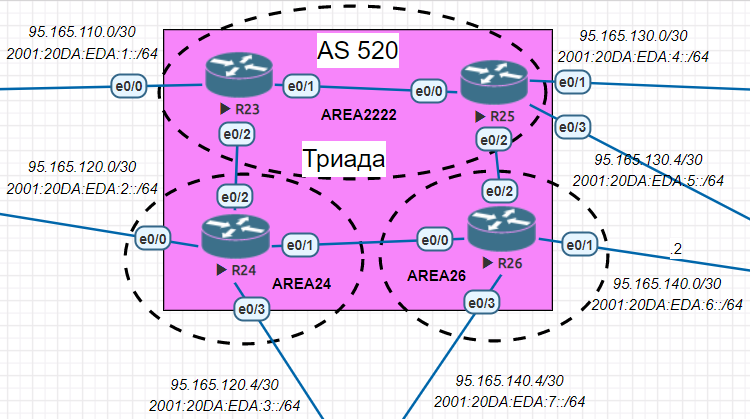

### Задание:
1. Настроить IS-IS в ISP Триада.
### Решение:
1. Настроим маршрутизаторы R23 и R25 в зоне 2222.
2. Настроим маршрутизатор R24 в зоне 24.
3. Настроим маршрутизатор R26 в зоне 26. 

#### Настроим маршрутизаторы R23 и R25 в зоне 2222:
Для базовой настройки IS-IS необходимо на каждом маршрутизаторе:
1) Включить IS-IS
2) Настроить NET адрес 
3) Включить IS-IS на интерфейсах для IPv4 и IPv6
```
Triad-R23#configure terminal 
Triad-R23(config)#router isis
Triad-R23(config-router)#net 49.2222.0000.0000.0023.00
Triad-R23(config-router)#exit
Triad-R23(config)#interface range Ethernet0/0-2
Triad-R23(config-if-range)#ip router isis
Triad-R23(config-if-range)#ipv6 router  isis 
Triad-R23(config-if-range)#end
Triad-R23#
```
```
Triad-R25#configure terminal
Triad-R25(config)#router isis
Triad-R25(config-router)#net 49.2222.0000.0000.0025.00
Triad-R25(config-router)#exit
Triad-R25(config)#interface range Ethernet0/0-3
Triad-R25(config-if-range)#ip router isis
Triad-R25(config-if-range)#ipv6 router  isis 
Triad-R25(config-if-range)#end
Triad-R25#
```
#### Настроим маршрутизатор R24 в зоне 24:
```
Triad-R24#configure terminal 
Triad-R24(config)#router isis
Triad-R24(config-router)#net 49.0024.0000.0000.0024.00
Triad-R24(config-router)#exit
Triad-R24(config)#interface range Ethernet0/0-3
Triad-R24(config-if-range)#ip router isis
Triad-R24(config-if-range)#ipv6 router isis
Triad-R24(config-if-range)#end
Triad-R24#
```
#### Настроим маршрутизатор R26 в зоне 26:
```
Triad-R26#configure terminal
Triad-R26(config)#router isis
Triad-R26(config-router)#net 49.0026.0000.0000.0026.00
Triad-R26(config-router)#exit
Triad-R26(config)#interface range Ethernet0/0-3
Triad-R26(config-if-range)#ip router isis
Triad-R26(config-if-range)#ipv6 router isis
Triad-R26(config-if-range)#end
Triad-R26#
```
### Итоговая графическая схема
 
