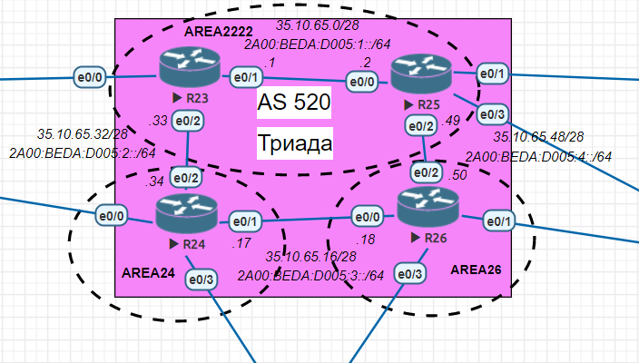

# Настройка IS-IS в офисе Триада
## Задание:
Настроить IS-IS в ISP Триада.

## Решение:
1. [Настроим маршрутизаторы R23 и R25 в зоне 2222](https://github.com/GAFisher/otus-network-engineer/blob/main/homework_is-is/README.md#настроим-маршрутизаторы-r23-и-r25-в-зоне-2222)
2. [Настроим маршрутизатор R24 в зоне 24](https://github.com/GAFisher/otus-network-engineer/blob/main/homework_is-is/README.md#настроим-маршрутизатор-r24-в-зоне-24)
3. [Настроим маршрутизатор R26 в зоне 26](https://github.com/GAFisher/otus-network-engineer/blob/main/homework_is-is/README.md#настроим-маршрутизатор-r26-в-зоне-26) 
4. [Посмотрим соседей и таблицу маршрутизации на кажом роутере](https://github.com/GAFisher/otus-network-engineer/blob/main/homework_is-is/README.md#посмотрим-соседей-и-таблицу-маршрутизации)
5. [Итоговая графическая схема](https://github.com/GAFisher/otus-network-engineer/blob/main/homework_is-is/README.md#итоговая-графическая-схема)

### Настроим маршрутизаторы R23 и R25 в зоне 2222:
Для базовой настройки IS-IS необходимо на каждом маршрутизаторе:
1) Включить IS-IS
2) Настроить NET адрес 
3) Включить IS-IS на интерфейсах для IPv4 и IPv6
#### R23
```
Triad-R23#configure terminal 
Triad-R23(config)#router isis
Triad-R23(config-router)#net 49.2222.0000.0000.0023.00
Triad-R23(config-router)#exit
Triad-R23(config)#interface range Ethernet0/1-2
Triad-R23(config-if-range)#ip router isis
Triad-R23(config-if-range)#ipv6 router  isis 
Triad-R23(config-if-range)#end
Triad-R23#
```
#### R25
```
Triad-R25#configure terminal
Triad-R25(config)#router isis
Triad-R25(config-router)#net 49.2222.0000.0000.0025.00
Triad-R25(config-router)#exit
Triad-R25(config)#interface range Ethernet0/0, Ethernet0/2
Triad-R25(config-if-range)#ip router isis
Triad-R25(config-if-range)#ipv6 router  isis 
Triad-R25(config-if-range)#end
Triad-R25#
```
[[Наверх]](https://github.com/GAFisher/otus-network-engineer/blob/main/homework_is-is/README.md#настройка-is-is-в-офисе-триада)
### Настроим маршрутизатор R24 в зоне 24:
```
Triad-R24#configure terminal 
Triad-R24(config)#router isis
Triad-R24(config-router)#net 49.0024.0000.0000.0024.00
Triad-R24(config-router)#exit
Triad-R24(config)#interface range Ethernet0/1-2
Triad-R24(config-if-range)#ip router isis
Triad-R24(config-if-range)#ipv6 router isis
Triad-R24(config-if-range)#end
Triad-R24#
```
[[Наверх]](https://github.com/GAFisher/otus-network-engineer/blob/main/homework_is-is/README.md#настройка-is-is-в-офисе-триада)
### Настроим маршрутизатор R26 в зоне 26:
```
Triad-R26#configure terminal
Triad-R26(config)#router isis
Triad-R26(config-router)#net 49.0026.0000.0000.0026.00
Triad-R26(config-router)#exit
Triad-R26(config)#interface range Ethernet0/0, Ethernet0/2
Triad-R26(config-if-range)#ip router isis
Triad-R26(config-if-range)#ipv6 router isis
Triad-R26(config-if-range)#end
Triad-R26#
```
[[Наверх]](https://github.com/GAFisher/otus-network-engineer/blob/main/homework_is-is/README.md#настройка-is-is-в-офисе-триада)
### Посмотрим соседей и таблицу маршрутизации:

<details>
  <summary>R23</summary>

      Triad-R23#show isis neighbors

      System Id      Type Interface   IP Address      State Holdtime Circuit Id
      Triad-R24      L2   Et0/2       35.10.65.34     UP    8        Triad-R24.03       
      Triad-R25      L1   Et0/1       35.10.65.2      UP    9        Triad-R25.01       
      Triad-R25      L2   Et0/1       35.10.65.2      UP    8        Triad-R25.01       
      Triad-R23#show ip route isis | begin Gateway
      Gateway of last resort is not set

            35.0.0.0/8 is variably subnetted, 6 subnets, 2 masks
      i L2     35.10.65.16/28 [115/20] via 35.10.65.34, 00:11:53, Ethernet0/2
      i L1     35.10.65.48/28 [115/20] via 35.10.65.2, 00:13:07, Ethernet0/1
      Triad-R23#show ipv6 route isis | begin Application
             lr - LISP site-registrations, ld - LISP dyn-eid, a - Application
      I2  2A00:BEDA:D005:3::/64 [115/20]
           via FE80::24, Ethernet0/2
      I1  2A00:BEDA:D005:4::/64 [115/20]
           via FE80::25, Ethernet0/1
      Triad-R23#

</details>

<details>
  <summary>R25</summary>
  
      Triad-R25#show isis neighbors

      System Id      Type Interface   IP Address      State Holdtime Circuit Id
      Triad-R23      L1   Et0/0       35.10.65.1      UP    27       Triad-R25.01       
      Triad-R23      L2   Et0/0       35.10.65.1      UP    25       Triad-R25.01       
      Triad-R26      L2   Et0/2       35.10.65.50     UP    9        Triad-R26.02       
      Triad-R25#show ip route isis | begin Gateway
      Gateway of last resort is not set

            35.0.0.0/8 is variably subnetted, 6 subnets, 2 masks
      i L2     35.10.65.16/28 [115/20] via 35.10.65.50, 00:06:06, Ethernet0/2
      i L1     35.10.65.32/28 [115/20] via 35.10.65.1, 02:24:55, Ethernet0/0
      Triad-R25#show ipv6 route isis | begin Application
             lr - LISP site-registrations, ld - LISP dyn-eid, a - Application
      I1  2A00:BEDA:D005:2::/64 [115/20]
           via FE80::23, Ethernet0/0
      I2  2A00:BEDA:D005:3::/64 [115/20]
           via FE80::26, Ethernet0/2
      Triad-R25#
  
</details>

<details>
  <summary>R24</summary>
  
      Triad-R24#show isis neighbors

      System Id      Type Interface   IP Address      State Holdtime Circuit Id
      Triad-R23      L2   Et0/2       35.10.65.33     UP    27       Triad-R24.03       
      Triad-R26      L2   Et0/1       35.10.65.18     UP    7        Triad-R26.01       
      Triad-R24#show ip route isis | begin Gateway
      Gateway of last resort is not set

            35.0.0.0/8 is variably subnetted, 6 subnets, 2 masks
      i L2     35.10.65.0/28 [115/20] via 35.10.65.33, 02:21:56, Ethernet0/2
      i L2     35.10.65.48/28 [115/20] via 35.10.65.18, 00:05:04, Ethernet0/1
      Triad-R24#show ipv6 route isis | begin Application
             lr - LISP site-registrations, ld - LISP dyn-eid, a - Application
      I2  2A00:BEDA:D005:1::/64 [115/20]
           via FE80::23, Ethernet0/2
      I2  2A00:BEDA:D005:4::/64 [115/20]
           via FE80::26, Ethernet0/1
      Triad-R24#

</details> 
  
<details>
  <summary>R26</summary>
  
      Triad-R26#show isis neighbors

      System Id      Type Interface   IP Address      State Holdtime Circuit Id
      Triad-R24      L2   Et0/0       35.10.65.17     UP    28       Triad-R26.01       
      Triad-R25      L2   Et0/2       35.10.65.49     UP    24       Triad-R26.02       
      Triad-R26#show ip route isis | begin Gateway
      Gateway of last resort is not set

            35.0.0.0/8 is variably subnetted, 6 subnets, 2 masks
      i L2     35.10.65.0/28 [115/20] via 35.10.65.49, 00:06:49, Ethernet0/2
      i L2     35.10.65.32/28 [115/20] via 35.10.65.17, 00:07:08, Ethernet0/0
      Triad-R26#show ipv6 route isis | begin Application
             lr - LISP site-registrations, ld - LISP dyn-eid, a - Application
      I2  2A00:BEDA:D005:1::/64 [115/20]
           via FE80::25, Ethernet0/2
      I2  2A00:BEDA:D005:2::/64 [115/20]
           via FE80::24, Ethernet0/0
      Triad-R26#

  
</details> 

[[Наверх]](https://github.com/GAFisher/otus-network-engineer/blob/main/homework_is-is/README.md#настройка-is-is-в-офисе-триада)
### Итоговая графическая схема
 

[[Наверх]](https://github.com/GAFisher/otus-network-engineer/blob/main/homework_is-is/README.md#настройка-is-is-в-офисе-триада)
